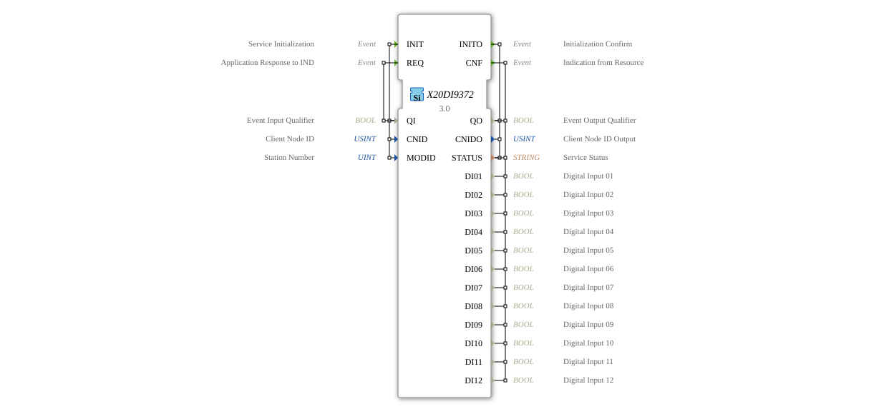

# X20DI9372

* * * * * * * * * *

## Introduction

The X20DI9372 function block is used to read digital signals via the openPOWERLINK fieldbus. It corresponds to the B&R X20DI9372 digital input module (12 channels).

## Interface Structure

### **Event Inputs**

- **INIT**: Initialization.
- **REQ**: Update input data.

### **Event Outputs**

- **INITO**: Initialization confirmed.
- **CNF**: New data available.

### **Data Inputs**

- **QI** (BOOL): Qualifier.
- **CNID** (USINT): Client Node ID.
- **MODID** (UINT): Module ID.

### **Data Outputs**

- **QO** (BOOL): Qualifier.
- **CNIDO** (USINT): Confirmed Node ID.
- **STATUS** (STRING): Status.
- **DI01** - **DI12** (BOOL): Digital Inputs 01 to 12.

## Functionality

Reads the status of the 12 digital inputs from the module.

## Metadata

| Attribute | Value |
| :--- | :--- |
| Copyright | (c) 2012 AIT |
| License | EPL-2.0 |
| Version | 3.0 (2025-04-14, Patrick Aigner) |
| 4diac Package | powerlink |

---

### 🌐 Related topic subpages on ms-muc-docs.de

- [🌐 Eclipse 4diac IDE & Color Reference on ms-muc-docs.de](https://www.ms-muc-docs.de/iec-61499/eclipse-4diac/)

]
