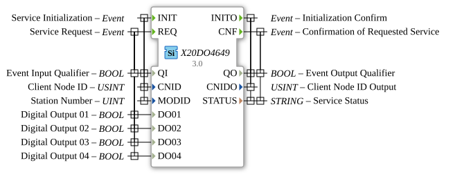

# X20DO4649

* * * * * * * * * *
## Introduction

The X20DO4649 function block is used to control digital outputs via the openPOWERLINK fieldbus. It corresponds to the B&R X20DO4649 digital output module (4 channels).

## Interface Structure

### **Event Inputs**

- **INIT**: Initialization.
- **REQ**: Write outputs.

### **Event Outputs**

- **INITO**: Initialization confirmed.
- **CNF**: Write operation confirmed.

### **Data Inputs**

- **QI** (BOOL): Qualifier.
- **CNID** (USINT): Client Node ID.
- **MODID** (UINT): Module ID.
- **DO01** (BOOL): Digital Output 01.
- **DO02** (BOOL): Digital Output 02.
- **DO03** (BOOL): Digital Output 03.
- **DO04** (BOOL): Digital Output 04.

### **Data Outputs**

- **QO** (BOOL): Qualifier.
- **CNIDO** (USINT): Confirmed Node ID.
- **STATUS** (STRING): Status.

## Functionality

Sets the digital outputs on the module according to the input values `DO01`-`DO04`.

## Metadata

| Attribute | Value |
| :--- | :--- |
| Copyright | (c) 2011 AIT |
| License | EPL-2.0 |
| Version | 3.0 (April 14, 2025, Patrick Aigner) |
| 4diac package | powerlink |

---

### 🌐 Related topic subpages on ms-muc-docs.de

* [🌐 Eclipse 4diac IDE & Color Reference on ms-muc-docs.de](https://www.ms-muc-docs.de/iec-61499/eclipse-4diac/)

]