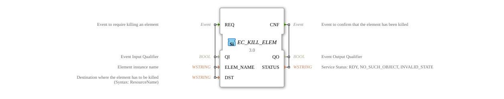

# EC_KILL_ELEM

* * * * * * * * * *
## Introduction
The EC_KILL_ELEM function block is used to terminate instances according to the state machine of IEC 61499 function blocks. It enables the targeted termination of function block instances, connections (event/data), resources, or devices within a 4diac system.

## Interface Structure

### **Event Inputs**
- **REQ**: Event to request the termination of an element

### **Event Outputs**
- **CNF**: Event to confirm that the element has been terminated

### **Data Inputs**
- **QI** (BOOL): Event input qualifier
- **ELEM_NAME** (WSTRING): Name of the element instance
- **DST** (WSTRING): Destination where the element must be terminated (Syntax: ResourceName)

### **Data Outputs**
- **QO** (BOOL): Event output qualifier
- **STATUS** (WSTRING): Service status (RDY, NO_SUCH_OBJECT, INVALID_STATE)

### **Adapters**
No adapter interfaces are available.

## Functionality

The function block responds to the REQ event and attempts to terminate the specified element (function block, connection, resource, or device) at the specified target resource. Upon execution, the CNF event is output with the corresponding status.

## Technical Features
- Supports terminating various element types (FBs, connections, resources, devices)
- Uses WSTRING data types for element names and targets
- Provides detailed status feedback on the termination process
- Implemented according to IEC 61499 Execution Control Services

## Status Overview
The function block has several service sequences:

- **normal_establishment**: Successful initialization
- **unsuccessful_establishment**: Failed initialization
- **request_confirm**: Successful termination request
- **request_inhibited**: Suppressed termination request
- **request_error**: Failed termination request
- **application_initiated_termination**: Application-initiated termination
- **resource_initiated_termination**: Resource-initiated termination

## Application Scenarios
- Dynamic reconfiguration of automation systems
- Targeted termination of faulty components
- Resource management in distributed systems
- System maintenance and -Updates
- Error Handling and System Recovery

## ⚖️ Comparison with Similar Blocks
Compared to other execution control blocks, EC_KILL_ELEM offers specific functions for terminating element instances, while similar blocks often provide creation or management functions. Its ability to handle various element types (FBs, connections, resources, devices) makes it particularly versatile.

## Conclusion
EC_KILL_ELEM is an essential building block for reconfiguration tasks in IEC 61499-based systems. Its ability to selectively terminate elements enables dynamic system adjustments and robust error handling strategies in industrial automation solutions.

--

### 🌐 Related Topic Subpages on ms-muc-docs.de
* [🌐 Eclipse 4diac IDE & Color Reference on ms-muc-docs.de](https://www.ms-muc-docs.de/iec-61499/eclipse-4diac/)

]
