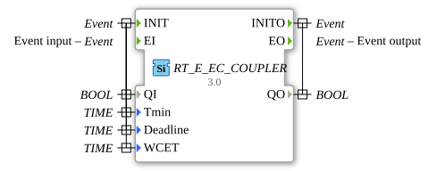

# RT_E_EC_COUPLER

* * * * * * * * * *
## Introduction

Couples event chains with real-time parameters.

## Metadata

| Attribute | Value |
| :--- | :--- |
| License | EPL-2.0 |
| Version | 3.0 (2025-04-14, Patrick Aigner) |
| 4diac Package | eclipse4diac::rtevents |

---

### 🌐 Related topic subpages on ms-muc-docs.de

* [🌐 Eclipse 4diac IDE & Color Reference on ms-muc-docs.de](https://www.ms-muc-docs.de/iec-61499/eclipse-4diac/)

]