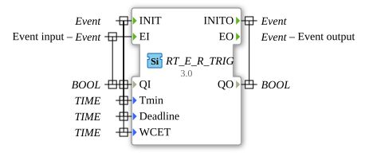

# RT_E_R_TRIG

* * * * * * * * * *

## Introduction

Real-time variant of the E_R_TRIG function block (rising edge).

## Metadata

| Attribute | Value |
| :--- | :--- |
| License | EPL-2.0 |
| Version | 3.0 (2025-04-14, Patrick Aigner) |
| 4diac package | eclipse4diac::rtevents |

---

### 🌐 Related topic subpages on ms-muc-docs.de

- [🌐 Eclipse 4diac IDE & color reference on ms-muc-docs.de](https://www.ms-muc-docs.de/iec-61499/eclipse-4diac/)
