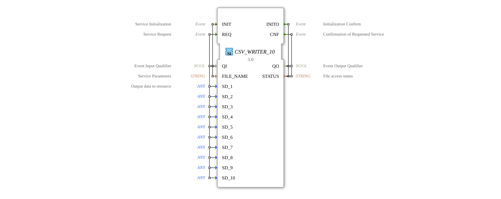

# CSV_WRITER_10

* * * * * * * * * *
## Introduction
The CSV_WRITER_10 function block is used to write data to a CSV file. It allows you to save up to 10 different data values in a structured text file. This block is particularly useful for data collection, logging, and exchanging data with other systems.


## Interface Structure

### **Event Inputs**
- **INIT**: Initializes the function block and specifies the file name (using QI and FILE_NAME)
- **REQ**: Triggers the write operation (using QI and SD_1 to SD_10)

### **Event Outputs**
- **INITO**: Confirms initialization (using QO and STATUS)
- **CNF**: Confirms the write operation (using QO and STATUS)

### **Data Inputs**
- **QI**: BOOL - Qualifies the event inputs
- **FILE_NAME**: STRING - Name of the CSV file
- **SD_1 to SD_10**: ANY - Data values to be written (any type)

### **Data Outputs**
- **QO**: BOOL - Qualifies the Event Outputs
- **STATUS**: STRING - File access status message

### **Adapter**
No adapters available.

```
## Functionality
1. **Initialization**: INIT with a valid FILE_NAME prepares the CSV file.

2. **Write Data**: REQ writes the current values from SD_1 to SD_10 as a new line to the file.

3. **Status Feedback**: Each action generates a status message (successful/failed).

## Technical Features
- Supports any data type (ANY) for the values to be written.
- Automatic conversion of data to text format.
- Thread-safe file access.
- Maximum capacity of 10 data values per line.

## Status Overview
1. **Not Initialized**: Before INIT.
2. **Ready**: After successful initialization.
3. **Error**: In case of file access problems.

## Application Scenarios
- Data acquisition of process values.
- Creation of log files.
- Export of measurement data for external analysis.
- Interface to spreadsheet programs.

## ⚖️ Comparison with Similar Modules
- Compared to simpler This block offers CSV writers greater flexibility through 10 data channels.
- Unlike hard-typed writers, it supports any data type.
- Provides more detailed status feedback than basic versions.

## Conclusion
The CSV_WRITER_10 is a powerful function block for structured data storage, particularly well-suited for applications with multiple values to be logged simultaneously. Its flexible type support and detailed status feedback make it a robust solution for industrial data acquisition tasks.
