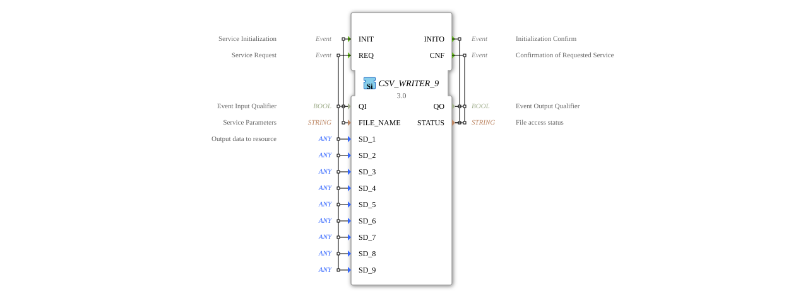

# CSV_WRITER_9

* * * * * * * * * *
## Introduction
The CSV_WRITER_9 is a function block for creating CSV files. It allows you to write up to nine different data points to a CSV file. This function block is part of the eclipse4diac::utils package and is suitable for applications that need to store data in a standardized format.

## Interface Structure

### **Event Inputs**
- **INIT**: Initializes the function block and sets the file name. Used with `QI` and `FILE_NAME`.
- **REQ**: Starts the writing process to the CSV file. Used with `QI` and data points `SD_1` through `SD_9`.

### **Event Outputs**
- **INITO**: Confirms initialization and returns the status. Used with `QO` and `STATUS`.
- **CNF**: Confirms successful or failed write operation. Used with `QO` and `STATUS`.

### **Data Inputs**
- **QI**: Boolean qualifier for event inputs.
- **FILE_NAME**: String specifying the name of the CSV file.
- **SD_1** to **SD_9**: Data points of type `ANY`, which are written to the CSV file.

### **Data Outputs**
- **QO**: Boolean qualifier for event outputs.
- **STATUS**: String indicating the status of file access.

### **Adapters**
No adapters are defined.

## Functionality

1. **Initialization**: The function block is initialized by the `INIT` event. The filename is set via `FILE_NAME`.

2. **Write Operation**: The `REQ` event triggers the write operation. Data points `SD_1` to `SD_9` are written to the CSV file.

3. **Confirmation**: The status of the operation is returned via `INITO` or `CNF`.

## Technical Features
- Supports up to nine data points (`SD_1` to `SD_9`) of type `ANY`.
- The file access status is returned via the `STATUS` output.
- This function block is part of the eclipse4diac::utils package and is subject to the Eclipse Public License 2.0.

## Status Overview
- **Initialization**: Successful (`INITO+`) or failed (`INITO-`).
- **Write Operation**: Successful (`CNF+`) or failed (`CNF-`).

## Application Scenarios
- Data acquisition and storage in industrial control systems.
- Logging of process data to a standardized CSV file.
- Integration into larger automation solutions for data processing.

## ⚖️ Comparison with Similar Function Blocks
- Compared to simpler CSV writer function blocks, CSV_WRITER_9 offers the ability to write up to nine data points simultaneously.
- Other function blocks may offer less flexibility in data types due to the use of `ANY`.

## Conclusion

The CSV_WRITER_9 is a powerful function block for creating CSV files in the 4diac IDE. Its flexibility in data ingestion and clear status feedback make it a good choice for applications that require structured data storage.

---

### 🌐 Related topic subpages on ms-muc-docs.de
* [🌐 Eclipse 4diac IDE & Color Reference on ms-muc-docs.de](https://www.ms-muc-docs.de/iec-61499/eclipse-4diac/)
