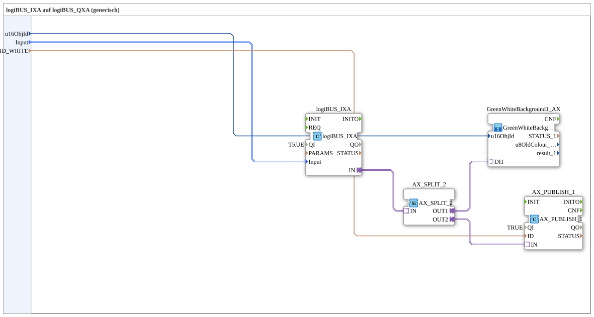

# logiBUS_IXA_BG_OPC

* * * * * * * * * *
## Introduction

`logiBUS_IXA_BG_OPC` is the reusable block for **a single digital input** with VT status display (background color) and OPC-UA publish. It is instantiated 8 times with different parameters in [`InputOutputTesterButton_DIDO_OPC_UA`](../../../../Uebungen/test_AX/Meins/InputOutputTester/Button_DIDO_OPC_UA/InputOutputTesterButton_DIDO_OPC_UA.md) and is reused unchanged for the 8 inputs in the PWM example [`InputOutputTesterButton_PWM_OPC_UA`](../../../../Uebungen/test_AX/Meins/InputOutputTester/Button_PWM_OPC_UA/InputOutputTesterButton_PWM_OPC_UA.md).

## Function Blocks (FBs) Used

### Sub-blocks: logiBUS_IXA_BG_OPC

- **Type**: SubAppType
- **Internal FBs used**:
    - **logiBUS_IXA**: `logiBUS::io::DI::logiBUS_IXA` — adapter-based digital input; parameter `QI=TRUE`, `Input` identifies `Input_I1..I8`.
    - **AX_SPLIT_2**: `adapter::events::unidirectional::AX_SPLIT_2` — splits the single adapter signal from `logiBUS_IXA.IN` into two independent destinations.
    - **GreenWhiteBackground1_AX** (SubApp, `MyLib::sys`): sets the VT background color (green/white) to match the input state.
    - **AX_PUBLISH_1**: `adapter::net::AX_PUBLISH_1` — OPC-UA publish adapter, `QI=TRUE`.
- **Functionality**: Purely one-way data flow from the physical input to two display/reporting paths — no write-back possible, since a digital input cannot be set externally.

## Program Flow and Connections

1. `Input` (parameter, identifies `Input_I1..I8`) → `logiBUS_IXA.Input` (data connection, hidden).
2. `u16ObjId` (VT object ID of the status display) → `GreenWhiteBackground1_AX.u16ObjId`.
3. `ID_WRITE` (OPC-UA address) → `AX_PUBLISH_1.ID`.
4. **Adapter chain**: `logiBUS_IXA.IN` → `AX_SPLIT_2.IN` → `AX_SPLIT_2.OUT1` → `GreenWhiteBackground1_AX.DI1` (VT display) and `AX_SPLIT_2.OUT2` → `AX_PUBLISH_1.IN` (OPC-UA publish).

## Technical Details

- **AX_SPLIT_2 instead of two data connections**: since an adapter output can only be connected directly to one place, `AX_SPLIT_2` splits the signal for the VT display and the OPC-UA publish.
- **Unidirectional**: unlike its output counterpart [`Button_IXA_TO_logiBUS_QXA_BG_OPC`](./Button_IXA_TO_logiBUS_QXA_BG_OPC.md), there is no `AX_SUBSCRIBE_1` here — an input is never written from the web.

## Application Scenarios

- Any exercise with digital inputs that should be visible both on the VT (status color) and via OPC-UA (web client).

## Summary

`logiBUS_IXA_BG_OPC` encapsulates the standard combination "digital input + VT status color + OPC-UA publish" in a single, repeatedly reusable block.

## 🛠️ Related Exercises

* [InputOutputTesterButton_DIDO_OPC_UA](../../../../Uebungen/test_AX/Meins/InputOutputTester/Button_DIDO_OPC_UA/InputOutputTesterButton_DIDO_OPC_UA.md)
* [InputOutputTesterButton_PWM_OPC_UA](../../../../Uebungen/test_AX/Meins/InputOutputTester/Button_PWM_OPC_UA/InputOutputTesterButton_PWM_OPC_UA.md)

---

### 🌐 Related topic subpages on ms-muc-docs.de

* [🌐 Eclipse 4diac IDE & color reference on ms-muc-docs.de](https://www.ms-muc-docs.de/iec-61499/eclipse-4diac/)
