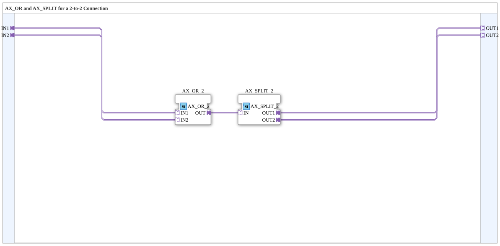

# AX_2_2

* * * * * * * * * *
## Introduction

`AX_2_2` ORs two AX adapter inputs (`IN1`, `IN2`) and distributes the result to two AX adapter outputs (`OUT1`, `OUT2`) — a "2-to-2" wiring block for cases where two independent boolean sources must be combined and the result forwarded to two independent destinations.

## Function Blocks (FBs) Used

### Sub-blocks: AX_2_2

- **Type**: SubAppType
- **Internal FBs used**:
    - **AX_OR_2**: `adapter::booleanOperators::AX_OR_2` — ORs two adapter inputs.
    - **AX_SPLIT_2**: `adapter::events::unidirectional::AX_SPLIT_2` — splits the OR result into two outputs.
- **Functionality**: `IN1 OR IN2` → `OUT1` and `OUT2` simultaneously.

## Program Flow and Connections

1. `IN1` → `AX_OR_2.IN1`, `IN2` → `AX_OR_2.IN2`.
2. `AX_OR_2.OUT` → `AX_SPLIT_2.IN`.
3. `AX_SPLIT_2.OUT1` → `OUT1`, `AX_SPLIT_2.OUT2` → `OUT2`.

## Application Scenarios

- Anywhere two independent boolean adapter sources need to be ORed and the combined result forwarded to two independent consumers (e.g. two VT status displays) without wiring a duplicate adapter connection.

## Summary

`AX_2_2` is a minimal block for "OR two sources, distribute to two destinations" — pure adapter wiring with no state logic of its own.

---

### 🌐 Related topic subpages on ms-muc-docs.de

* [🌐 Eclipse 4diac IDE & color reference on ms-muc-docs.de](https://www.ms-muc-docs.de/iec-61499/eclipse-4diac/)
