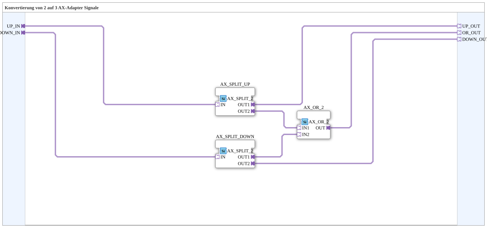

# AX_2_TO_3

* * * * * * * * * *
## Introduction

`AX_2_TO_3` takes two independent AX adapter signals (`UP_IN`, `DOWN_IN`) and provides three outputs: the two inputs passed through unchanged (`UP_OUT`, `DOWN_OUT`) plus their OR combination as a third signal (`OR_OUT`) — typically for "up"/"down" buttons where a combined "either direction active" signal is also needed.

## Function Blocks (FBs) Used

### Sub-blocks: AX_2_TO_3

- **Type**: SubAppType
- **Internal FBs used**:
    - **AX_SPLIT_UP** / **AX_SPLIT_DOWN**: each `adapter::events::unidirectional::AX_SPLIT_2` — split `UP_IN`/`DOWN_IN` each into a direct pass-through and a branch feeding the OR.
    - **AX_OR_2**: `adapter::booleanOperators::AX_OR_2` — combines both branches into `OR_OUT`.
- **Functionality**: `UP_IN` → `UP_OUT` (direct) and into `AX_OR_2`; `DOWN_IN` → `DOWN_OUT` (direct) and into `AX_OR_2`; `AX_OR_2.OUT` → `OR_OUT`.

## Program Flow and Connections

1. `UP_IN` → `AX_SPLIT_UP.IN` → `AX_SPLIT_UP.OUT1` → `UP_OUT`, `AX_SPLIT_UP.OUT2` → `AX_OR_2.IN1`.
2. `DOWN_IN` → `AX_SPLIT_DOWN.IN` → `AX_SPLIT_DOWN.OUT2` → `DOWN_OUT`, `AX_SPLIT_DOWN.OUT1` → `AX_OR_2.IN2`.
3. `AX_OR_2.OUT` → `OR_OUT`.

## Application Scenarios

- Ramp/ramp-button wiring (e.g. "up"/"down") where, besides the individual direction signals, a combined "either button active" signal is also needed (e.g. to light up a status indicator only while actively operated).

## Summary

`AX_2_TO_3` passes two adapter signals through unchanged and adds their OR combination as a third signal — a pure wiring helper with no state logic of its own.

---

### 🌐 Related topic subpages on ms-muc-docs.de

* [🌐 Eclipse 4diac IDE & color reference on ms-muc-docs.de](https://www.ms-muc-docs.de/iec-61499/eclipse-4diac/)
