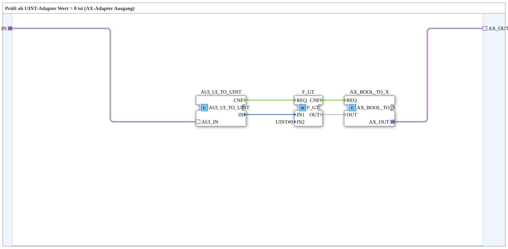

# AX_GT_0_UINT

* * * * * * * * * *
## Introduction

`AX_GT_0_UINT` checks whether a UINT adapter value is greater than 0 and outputs the result as a boolean AX adapter signal — useful for turning, say, an object-ID or counter value directly into an active/inactive signal for a VT status display.

## Function Blocks (FBs) Used

### Sub-blocks: AX_GT_0_UINT

- **Type**: SubAppType
- **Internal FBs used**:
    - **AUI_UI_TO_UINT**: `adapter::conversion::unidirectional::AUI_UI_TO_UINT` — unpacks the UINT adapter value (`AUI`) into a regular data connection.
    - **F_GT**: `iec61131::comparison::F_GT` — comparison `IN1 > IN2`, parameterized here with `IN2=UINT#0`.
    - **AX_BOOL_TO_X**: `adapter::conversion::unidirectional::AX_BOOL_TO_X` — repacks the boolean comparison result as an AX adapter.
- **Functionality**: `IN` (AUI) → unpacked to UINT → compared against 0 → output as an AX adapter.

## Program Flow and Connections

1. `IN` (adapter) → `AUI_UI_TO_UINT.AUI_IN`.
2. `AUI_UI_TO_UINT.IN` (data value) → `F_GT.IN1`; `F_GT.IN2 = UINT#0` (parameter).
3. `AUI_UI_TO_UINT.CNF` → `F_GT.REQ`; `F_GT.CNF` → `AX_BOOL_TO_X.REQ`.
4. `F_GT.OUT` → `AX_BOOL_TO_X.OUT`; `AX_BOOL_TO_X.AX_OUT` → `AX_OUT` (adapter).

## Application Scenarios

- Converting a UINT object-ID or counter value (e.g. "how many channels are active") into a simple boolean adapter signal for VT status displays or enable logic.

## Summary

`AX_GT_0_UINT` is a compact adapter wrapper around the standard comparison `F_GT` — converts "UINT > 0" directly into an AX adapter signal.

---

### 🌐 Related topic subpages on ms-muc-docs.de

* [🌐 Eclipse 4diac IDE & color reference on ms-muc-docs.de](https://www.ms-muc-docs.de/iec-61499/eclipse-4diac/)
