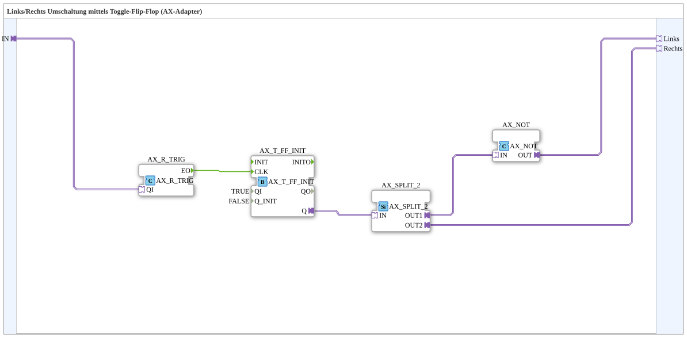

# AX_LinksRechts_T_FF

* * * * * * * * * *
## Introduction

`AX_LinksRechts_T_FF` ("left/right toggle flip-flop") converts a single button press (`IN`) via a toggle flip-flop into two complementary adapter outputs `Links`/`Rechts` (left/right) — each button press switches between "left active" and "right active".

## Function Blocks (FBs) Used

### Sub-blocks: AX_LinksRechts_T_FF

- **Type**: SubAppType
- **Internal FBs used**:
    - **AX_R_TRIG**: `adapter::events::unidirectional::AX_R_TRIG` — detects the button's rising edge.
    - **AX_T_FF_INIT**: `adapter::events::unidirectional::AX_T_FF_INIT` — toggle flip-flop with a defined initial state (`QI=TRUE`, `Q_INIT=FALSE`).
    - **AX_SPLIT_2**: `adapter::events::unidirectional::AX_SPLIT_2` — splits the flip-flop state.
    - **AX_NOT**: `adapter::booleanOperators::AX_NOT` — negates one of the two branches to produce the complementary signal.
- **Functionality**: Every rising edge on `IN` toggles `AX_T_FF_INIT.Q`. The direct state feeds `Rechts` (right), the negated state feeds `Links` (left) — so `Links` and `Rechts` are always exactly complementary (per the source comment: "AX_T_FF_INIT switches the Active output to FALSE, so LEFT is then TRUE").

## Program Flow and Connections

1. `IN` → `AX_R_TRIG.QI`; `AX_R_TRIG.EO` → `AX_T_FF_INIT.CLK` (toggles on every rising edge).
2. `AX_T_FF_INIT.Q` → `AX_SPLIT_2.IN`.
3. `AX_SPLIT_2.OUT1` → `AX_NOT.IN` → `AX_NOT.OUT` → `Links`.
4. `AX_SPLIT_2.OUT2` → `Rechts`.

## Application Scenarios

- Single-button switching between two mutually exclusive states (e.g. direction of travel, display toggling) without needing two separate buttons.

## Summary

`AX_LinksRechts_T_FF` implements a classic single-button toggle between two complementary states, using a toggle flip-flop with a defined initial state and a negation for the opposite signal.

---

### 🌐 Related topic subpages on ms-muc-docs.de

* [🌐 Eclipse 4diac IDE & color reference on ms-muc-docs.de](https://www.ms-muc-docs.de/iec-61499/eclipse-4diac/)
