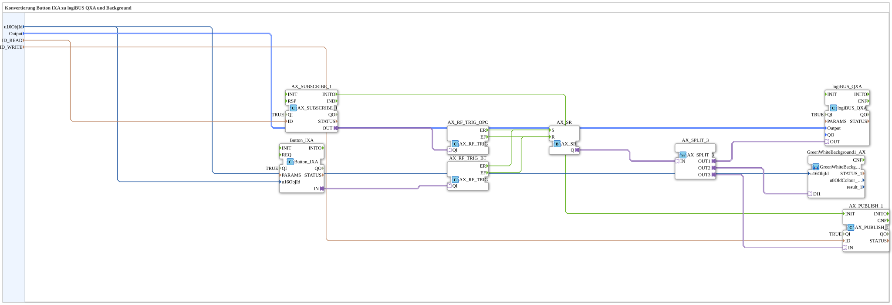

# Button_IXA_TO_logiBUS_QXA_BG_OPC

* * * * * * * * * *
## Introduction

`Button_IXA_TO_logiBUS_QXA_BG_OPC` extends [`Button_IXA_TO_logiBUS_QXA_BG`](./Button_IXA_TO_logiBUS_QXA_BG.md) with a bidirectional OPC-UA connection: the output state can be set both from the VT button and externally via OPC-UA (set/reset logic via `AX_SR`), and the resulting state is reported back via OPC-UA.

## Function Blocks Used

### Sub-blocks: Button_IXA_TO_logiBUS_QXA_BG_OPC

- **Type**: SubAppType
- **Internal FBs used**:
    - **Button_IXA**: `isobus::UT::io::Button::Button_IXA` — VT button adapter, `QI=TRUE`.
    - **AX_SUBSCRIBE_1**: `adapter::net::AX_SUBSCRIBE_1` — subscribes to an external BOOL setpoint via OPC-UA, address `ID_READ`, `QI=TRUE`.
    - **AX_RF_TRIG_BT**, **AX_RF_TRIG_OPC** (both type `AX_RF_TRIG`): `adapter::events::unidirectional::AX_RF_TRIG` — detect rising/falling edges (`ER`/`EF`) on the button and OPC-UA input respectively.
    - **AX_SR**: `adapter::events::unidirectional::AX_SR` — set/reset latch: set (`S`) and reset (`R`) by both edge detectors, regardless of whether the rising edge comes from the button or from OPC-UA.
    - **AX_SPLIT_3**: `adapter::events::unidirectional::AX_SPLIT_3` — splits the latched state into three outputs.
    - **logiBUS_QXA**: `logiBUS::io::DQ::logiBUS_QXA` — physical digital output, `QI=TRUE`.
    - **GreenWhiteBackground1_AX** (SubApp): `MyLib::sys::GreenWhiteBackground1_AX` — VT background-color indication, see [Background Color Blocks (shared pattern)](./Background-Color-Blocks.md).
    - **AX_PUBLISH_1**: `adapter::net::AX_PUBLISH_1` — publishes the resulting state via OPC-UA, address `ID_WRITE`, `QI=TRUE`.
- **Operation**: Both the VT button and an external OPC-UA write can toggle the `AX_SR` latch (rising edge = set, falling edge = reset, symmetric for both sources); the latched state is used three ways: physical output, VT background color, OPC-UA feedback.

## Program Flow and Connections

1. `u16ObjId` → `Button_IXA.u16ObjId` and `GreenWhiteBackground1_AX.u16ObjId`; `Output` → `logiBUS_QXA.Output`; `ID_READ` → `AX_SUBSCRIBE_1.ID`; `ID_WRITE` → `AX_PUBLISH_1.ID`.
2. `Button_IXA.IN` (adapter) → `AX_RF_TRIG_BT.QI`; `AX_SUBSCRIBE_1.OUT` (adapter) → `AX_RF_TRIG_OPC.QI`.
3. `AX_RF_TRIG_BT.ER`/`AX_RF_TRIG_OPC.ER` → `AX_SR.S`; `AX_RF_TRIG_BT.EF`/`AX_RF_TRIG_OPC.EF` → `AX_SR.R`.
4. `AX_SR.Q` (adapter) → `AX_SPLIT_3.IN`.
5. `AX_SPLIT_3.OUT1` → `logiBUS_QXA.OUT`; `AX_SPLIT_3.OUT2` → `GreenWhiteBackground1_AX.DI1`; `AX_SPLIT_3.OUT3` → `AX_PUBLISH_1.IN`.
6. `AX_SUBSCRIBE_1.INITO` → `AX_PUBLISH_1.INIT` (initial publication at startup).

## Technical Details

- The set/reset logic via `AX_SR` lets the button and the OPC-UA setpoint control the same output state on equal footing, with neither source taking priority — both edge detectors feed the same `S`/`R` inputs.
- Full bidirectional OPC-UA coupling: `AX_SUBSCRIBE_1` (read/control from outside) and `AX_PUBLISH_1` (report state outward) are independently addressable (`ID_READ` vs. `ID_WRITE`).

## Application Scenarios

- A VT button with a physical output and status indication that should additionally be remotely controllable from an upstream SCADA system via OPC-UA, with its state monitored there.

## Summary

Fully featured variant of the button-to-output family with bidirectional OPC-UA connectivity via a shared set/reset latch.

---

### 🌐 Related topic subpages on ms-muc-docs.de

* [🌐 Eclipse 4diac IDE & color reference on ms-muc-docs.de](https://www.ms-muc-docs.de/iec-61499/eclipse-4diac/)
