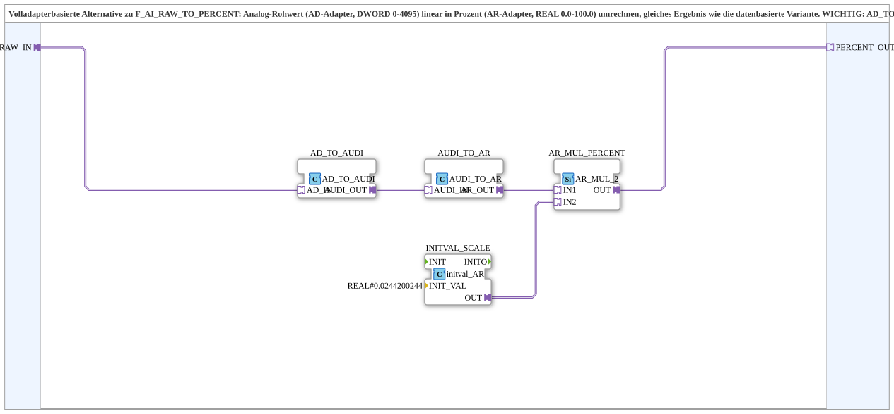

# F_AI_RAW_TO_PERCENT_AD

* * * * * * * * * *
## Introduction

`F_AI_RAW_TO_PERCENT_AD` is the fully adapter-based alternative to [`F_AI_RAW_TO_PERCENT`](./F_AI_RAW_TO_PERCENT.md): the same raw analog value (0-4095) is converted linearly to percent via AD/AR adapters instead of regular data connections — identical result, different wiring style.

> **⚠️ Important note from the block's own comment:** `AD_TO_AR`/`F_DWORD_TO_REAL` would be **wrong** here — that's a bit-reinterpretation (IEEE754 cast), not a numeric conversion (see `forte_real.cpp`, `CIEC_REAL::setValue`, `case e_DWORD: setValueSimple`). The correct path is `AD_TO_AUDI` (bit-reinterpretation DWORD→UDINT, valid here, same bit width/representation) followed by `AUDI_TO_AR` (internally uses `F_UDINT_TO_REAL`, a real numeric conversion). Details in [Numeric vs. bitwise: the FORTE conversion trap](../../../../Bibliotheken/ExternalLibraries/adapter/conversion/unidirectional/Numeric_vs_Bitwise.md).

## Function Blocks (FBs) Used

### Sub-blocks: F_AI_RAW_TO_PERCENT_AD

- **Type**: SubAppType
- **Internal FBs used**:
    - **AD_TO_AUDI**: `adapter::conversion::unidirectional::AD_TO_AUDI` — bit-reinterpretation DWORD adapter→UDINT adapter.
    - **AUDI_TO_AR**: `adapter::conversion::unidirectional::AUDI_TO_AR` — a real numeric cast UDINT adapter→REAL adapter.
    - **INITVAL_SCALE**: `adapter::types::unidirectional::AR::initval::initval_AR` — supplies the constant `REAL#0.0244200244` (= 100/4095) as an adapter.
    - **AR_MUL_PERCENT**: `adapter::iec61131::arithmetic::AR_MUL_2` — multiplies two REAL adapters.
- **Functionality**: `RAW_IN` (AD adapter, 0-4095) → `AD_TO_AUDI` → `AUDI_TO_AR` → multiplied by the constant → `PERCENT_OUT` (AR adapter, 0.0-100.0).

## Program Flow and Connections

1. `RAW_IN` → `AD_TO_AUDI.AD_IN` → `AD_TO_AUDI.AUDI_OUT` → `AUDI_TO_AR.AUDI_IN` → `AUDI_TO_AR.AR_OUT` → `AR_MUL_PERCENT.IN1`.
2. `INITVAL_SCALE.OUT` (constant 0.0244200244) → `AR_MUL_PERCENT.IN2`.
3. `AR_MUL_PERCENT.OUT` → `PERCENT_OUT`.

## Technical Details

- **Deliberate negative example in the comment**: the block's own comment explicitly documents why `AD_TO_AR` would be wrong here — a rare but valuable "anti-pattern" note right in the source.
- **Adapter constant instead of a parameter**: the scaling constant is supplied via `initval_AR` as an adapter rather than a classic FB parameter — consistent with the block's fully adapter-based design.

## Application Scenarios

- Like `F_AI_RAW_TO_PERCENT`, but for SubApp networks built consistently on adapter connections instead of classic data connections.

## Summary

`F_AI_RAW_TO_PERCENT_AD` delivers the same numerically correct DWORD→REAL percent conversion as `F_AI_RAW_TO_PERCENT`, fully adapter-based — and explicitly documents the bit-reinterpretation trap a naive `AD_TO_AR` wiring would create.

---

### 🌐 Related topic subpages on ms-muc-docs.de

* [🌐 Eclipse 4diac IDE & color reference on ms-muc-docs.de](https://www.ms-muc-docs.de/iec-61499/eclipse-4diac/)
