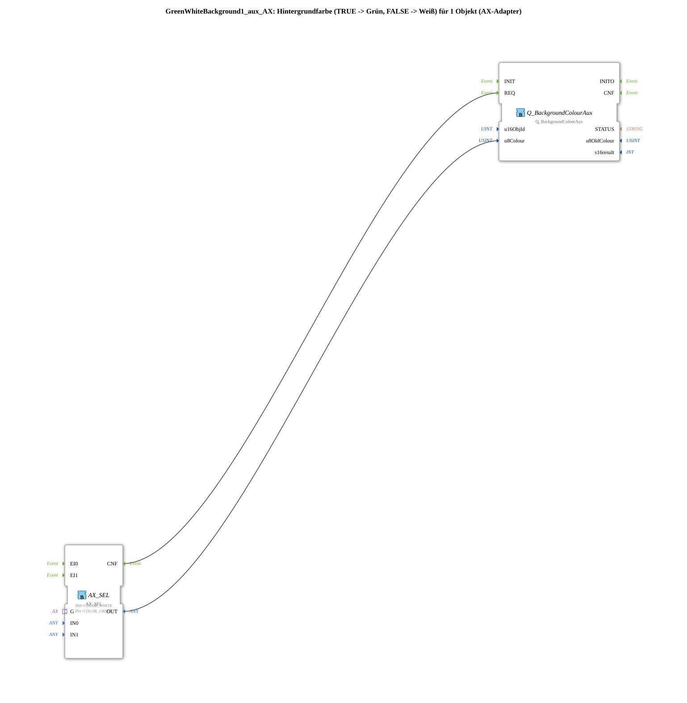

# GreenWhiteBackground1_aux_AX

* * * * * * * * * *
## Introduction

`GreenWhiteBackground1_aux_AX` switches the VT background color of one object based on a boolean selector signal: `TRUE` → **Grün**, `FALSE` → **Weiß**. The selector signal arrives via an `AX` adapter socket (`DI1`). The object ID is passed via input `u16ObjId`.

For the general pattern (selector → `AX_SEL`/`F_SEL` → `Q_BackgroundColour`), see [Background Color Blocks (shared pattern)](./Background-Color-Blocks.md).

## Summary

One of many variants in the background color block family: color pair Grün/Weiß, 1 object, adapter selector.

---

### 🌐 Related topic subpages on ms-muc-docs.de

* [🌐 Eclipse 4diac IDE & color reference on ms-muc-docs.de](https://www.ms-muc-docs.de/iec-61499/eclipse-4diac/)
