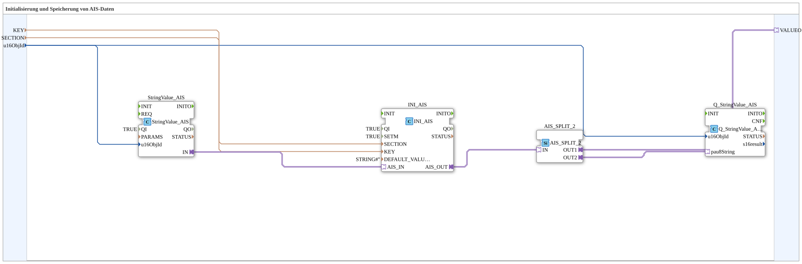

# INI_IN_AND_STORE_AIS

* * * * * * * * * *
## Introduction

`INI_IN_AND_STORE_AIS` persistently stores a string value entered via the VT (AIS adapter) in an INI file and automatically reloads it on deployment.

For the general pattern, see [INI_IN_AND_STORE / NVS_IN_AND_STORE (shared pattern)](./INI-NVS-Storage-Blocks.md).

## Summary

AIS (string) variant of the INI storage family.

---

### 🌐 Related topic subpages on ms-muc-docs.de

* [🌐 Eclipse 4diac IDE & color reference on ms-muc-docs.de](https://www.ms-muc-docs.de/iec-61499/eclipse-4diac/)
