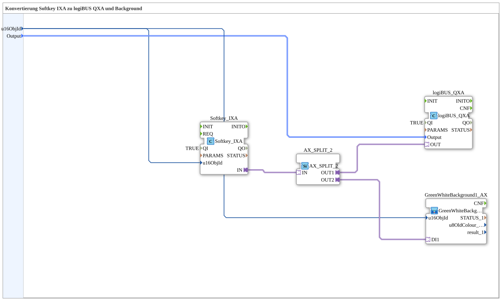

# Softkey_IXA_TO_logiBUS_QXA_BG

* * * * * * * * * *
## Introduction

`Softkey_IXA_TO_logiBUS_QXA_BG` extends [`Softkey_IXA_TO_logiBUS_QXA`](./Softkey_IXA_TO_logiBUS_QXA.md) with a VT status color — the softkey counterpart to [`Button_IXA_TO_logiBUS_QXA_BG`](./Button_IXA_TO_logiBUS_QXA_BG.md).

## Function Blocks (FBs) Used

### Sub-blocks: Softkey_IXA_TO_logiBUS_QXA_BG

- **Type**: SubAppType
- **Internal FBs used**:
    - **Softkey_IXA**: `isobus::UT::io::Softkey::Softkey_IXA` — VT softkey adapter.
    - **logiBUS_QXA**: `logiBUS::io::DQ::logiBUS_QXA` — physical digital output.
    - **AX_SPLIT_2**: `adapter::events::unidirectional::AX_SPLIT_2` — splits the softkey signal.
    - **GreenWhiteBackground1_AX** (SubApp, `MyLib::sys`): sets the VT status color (see [Background Color Blocks](./Background-Color-Blocks.md)).
- **Functionality**: `Softkey_IXA.IN` is distributed via `AX_SPLIT_2` to both `logiBUS_QXA.OUT` and `GreenWhiteBackground1_AX.DI1`.

## Program Flow and Connections

1. `u16ObjId` → `Softkey_IXA.u16ObjId` and `GreenWhiteBackground1_AX.u16ObjId`; `Output` → `logiBUS_QXA.Output`.
2. `Softkey_IXA.IN` → `AX_SPLIT_2.IN` → `AX_SPLIT_2.OUT1` → `logiBUS_QXA.OUT`, `AX_SPLIT_2.OUT2` → `GreenWhiteBackground1_AX.DI1`.

## Application Scenarios

- VT softkey with direct visual feedback, without OPC-UA.

## Summary

Softkey counterpart to `Button_IXA_TO_logiBUS_QXA_BG` — identical pattern, different control type.

---

### 🌐 Related topic subpages on ms-muc-docs.de

* [🌐 Eclipse 4diac IDE & color reference on ms-muc-docs.de](https://www.ms-muc-docs.de/iec-61499/eclipse-4diac/)
