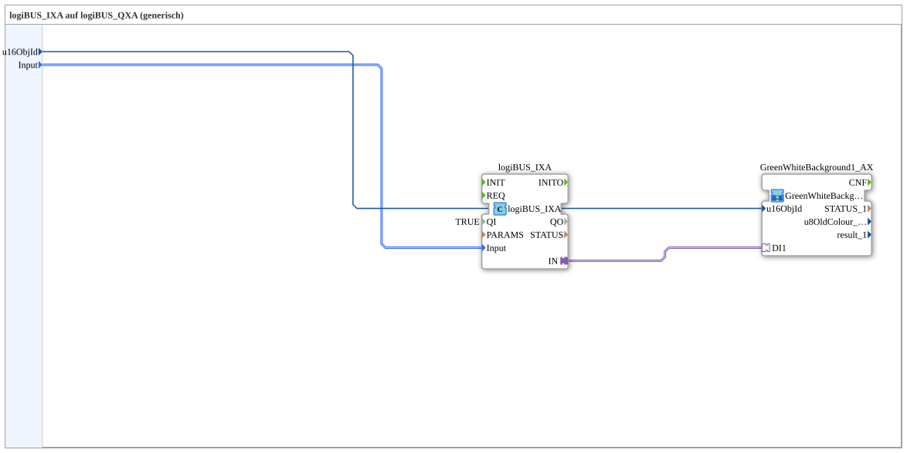

# logiBUS_IXA_BG

* * * * * * * * * *
## Introduction

`logiBUS_IXA_BG` connects a physical digital input (`logiBUS_IXA`) to a VT status indication via the background-color family `GreenWhiteBackground1_AX` (see [Background Color Blocks (shared pattern)](./Background-Color-Blocks.md)) — the current state of the input is made visible on the VT as a green/white background, with no OPC-UA connection. For the variant with additional OPC-UA feedback, see [`logiBUS_IXA_BG_OPC`](./logiBUS_IXA_BG_OPC.md).

## Function Blocks Used

### Sub-blocks: logiBUS_IXA_BG

- **Type**: SubAppType
- **Internal FBs used**:
    - **logiBUS_IXA**: `logiBUS::io::DI::logiBUS_IXA` — physical digital input, adapter output `IN`, `QI=TRUE`.
    - **GreenWhiteBackground1_AX** (SubApp): `MyLib::sys::GreenWhiteBackground1_AX` — single-object background-color block from the Background Color family, drives the VT object background color from `DI1`.
- **Operation**: The physical input's adapter output is wired directly to the `DI1` adapter input of the background-color block, which handles the color switch of a VT object.

## Program Flow and Connections

1. `Input` → `logiBUS_IXA.Input`; `u16ObjId` → `GreenWhiteBackground1_AX.u16ObjId`.
2. `logiBUS_IXA.IN` (adapter) → `GreenWhiteBackground1_AX.DI1` (adapter).

## Application Scenarios

- Purely visual status indication of a physical digital input on the VT (e.g. limit switch state), where the value does not need to be reported externally via OPC-UA.

## Summary

Combines a physical digital input with the standard background-color family into a simple VT status indication.

---

### 🌐 Related topic subpages on ms-muc-docs.de

* [🌐 Eclipse 4diac IDE & color reference on ms-muc-docs.de](https://www.ms-muc-docs.de/iec-61499/eclipse-4diac/)
