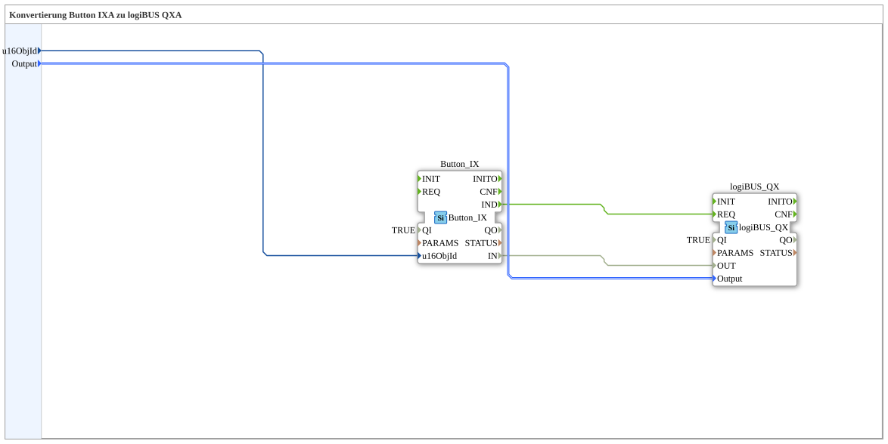

# Button_IX_TO_logiBUS_QX

* * * * * * * * * *
## Introduction

`Button_IX_TO_logiBUS_QX` is the test_B counterpart to [`Button_IXA_TO_logiBUS_QXA`](../../MyLib_AX/sys/Button_IXA_TO_logiBUS_QXA.md): a VT button (`Button_IX`) directly switches a physical digital output (`logiBUS_QX`) — here without adapters, using classic event/data connections.

## Function Blocks (FBs) Used

### Sub-blocks: Button_IX_TO_logiBUS_QX

- **Type**: SubAppType
- **Internal FBs used**:
    - **Button_IX**: `isobus::UT::io::Button::Button_IX` — VT button (non-adapter variant).
    - **logiBUS_QX**: `logiBUS::io::DQ::logiBUS_QX` — physical digital output (non-adapter variant).
- **Functionality**: `Button_IX.IND` triggers `logiBUS_QX.REQ`; the data value `Button_IX.IN` is wired directly to `logiBUS_QX.OUT`.

## Program Flow and Connections

1. `u16ObjId` → `Button_IX.u16ObjId`; `Output` → `logiBUS_QX.Output`.
2. `Button_IX.IND` → `logiBUS_QX.REQ`; `Button_IX.IN` → `logiBUS_QX.OUT`.

## Application Scenarios

- Minimal VT-button-to-output block for test_B, with no status display.

## Summary

test_B counterpart to `Button_IXA_TO_logiBUS_QXA`: same function, classic event/data connections instead of adapters.

---

### 🌐 Related topic subpages on ms-muc-docs.de

* [🌐 Eclipse 4diac IDE & color reference on ms-muc-docs.de](https://www.ms-muc-docs.de/iec-61499/eclipse-4diac/)
