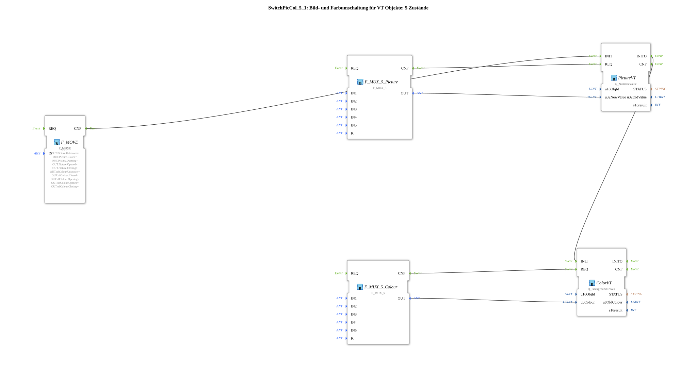

# SwitchPicCol_5_1

* * * * * * * * * *
## Introduction

`SwitchPicCol_5_1` switches both a VT picture (`Picture`, via `Q_NumericValue`) **and** a VT background color (`Color`, via `Q_BackgroundColour`) between 5 states (slide-valve animation) — two parallel `F_MUX_5` multiplexers (one for picture IDs, one for color values), both driven by the same `iSTATE` value, targeting regular (non-AUX) objects.

For the general pattern, see [SwitchPic(Col) Blocks (shared pattern)](./SwitchPic-Blocks.md).

## Summary

Combines picture and color switching (`Col`) for 5 states on regular VT objects.

---

### 🌐 Related topic subpages on ms-muc-docs.de

* [🌐 Eclipse 4diac IDE & color reference on ms-muc-docs.de](https://www.ms-muc-docs.de/iec-61499/eclipse-4diac/)
