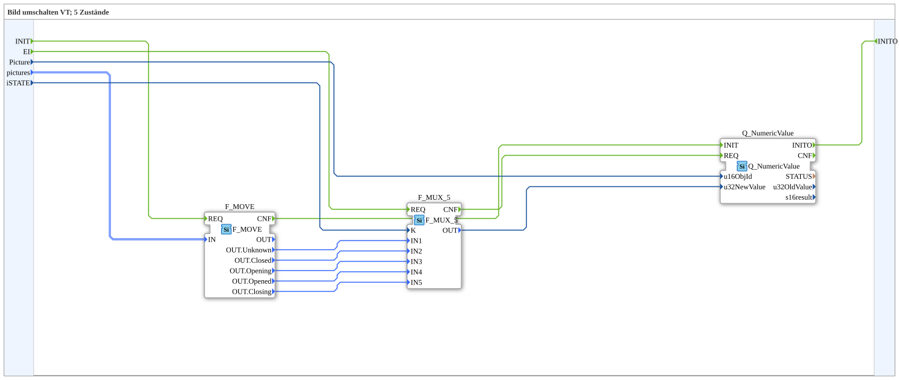

# SwitchPic_5_1

* * * * * * * * * *
## Introduction

`SwitchPic_5_1` switches a VT picture between 5 states (slide-valve animation: `Unknown`, `Closed`, `Opening`, `Opened`, `Closing`) based on an `iSTATE` value (`USINT`) — only the regular VT object (`Picture`, via `Q_NumericValue`), no AUX object.

For the general pattern, see [SwitchPic(Col) Blocks (shared pattern)](./SwitchPic-Blocks.md).

## Summary

Variant "1" (regular object only) of the 5-state picture switch — the 5-state counterpart to [`SwitchPic_2_1`](./SwitchPic_2_1.md).

---

### 🌐 Related topic subpages on ms-muc-docs.de

* [🌐 Eclipse 4diac IDE & color reference on ms-muc-docs.de](https://www.ms-muc-docs.de/iec-61499/eclipse-4diac/)
