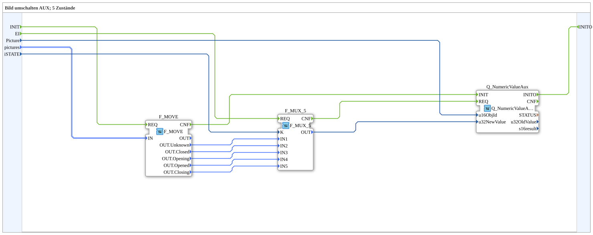

# SwitchPic_5_1_aux

* * * * * * * * * *
## Introduction

`SwitchPic_5_1_aux` switches a VT picture between 5 states (slide-valve animation) based on an `iSTATE` value — exclusively for an **auxiliary function** object (`Q_NumericValueAux`), no regular VT object.

For the general pattern, see [SwitchPic(Col) Blocks (shared pattern)](./SwitchPic-Blocks.md).

## Summary

AUX counterpart to [`SwitchPic_5_1`](./SwitchPic_5_1.md).

---

### 🌐 Related topic subpages on ms-muc-docs.de

* [🌐 Eclipse 4diac IDE & color reference on ms-muc-docs.de](https://www.ms-muc-docs.de/iec-61499/eclipse-4diac/)
