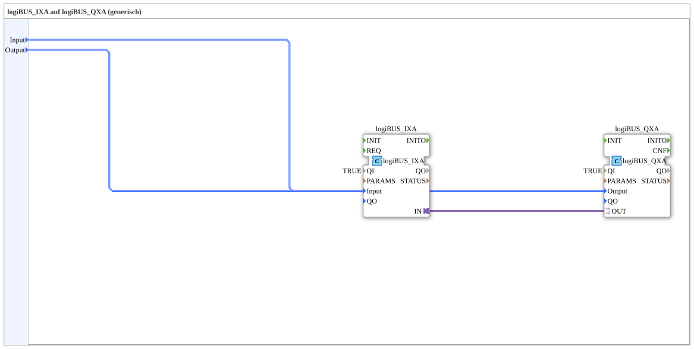

# logiBUS_IXA_TO_logiBUS_QXA

* * * * * * * * * *
## Introduction

`logiBUS_IXA_TO_logiBUS_QXA` wires a physical digital input (`logiBUS_IXA`) directly to a physical digital output (`logiBUS_QXA`) — a pure hardware pass-through with no VT involvement, adapter-based (acyclic with confirmation, `QI=TRUE`). For the event-driven variant without an adapter, see [`logiBUS_IX_TO_logiBUS_QX`](./logiBUS_IX_TO_logiBUS_QX.md).

## Function Blocks Used

### Sub-blocks: logiBUS_IXA_TO_logiBUS_QXA

- **Type**: SubAppType
- **Internal FBs used**:
    - **logiBUS_IXA**: `logiBUS::io::DI::logiBUS_IXA` — physical digital input, adapter output `IN`, `QI=TRUE`.
    - **logiBUS_QXA**: `logiBUS::io::DQ::logiBUS_QXA` — physical digital output, adapter input `OUT`, `QI=TRUE`.
- **Operation**: The input's adapter output is wired directly to the output's adapter input — no intermediate logic, no VT connection.

## Program Flow and Connections

1. `Input` → `logiBUS_IXA.Input`; `Output` → `logiBUS_QXA.Output`.
2. `logiBUS_IXA.IN` (adapter) → `logiBUS_QXA.OUT` (adapter) — direct pass-through.

## Application Scenarios

- Pure hardware-to-hardware wiring, e.g. for a physical emergency-stop contact or a fixed interlock that must work independently of the VT.

## Summary

Adapter-based direct wiring of a physical input to a physical output, with no VT or event logic.

---

### 🌐 Related topic subpages on ms-muc-docs.de

* [🌐 Eclipse 4diac IDE & color reference on ms-muc-docs.de](https://www.ms-muc-docs.de/iec-61499/eclipse-4diac/)
