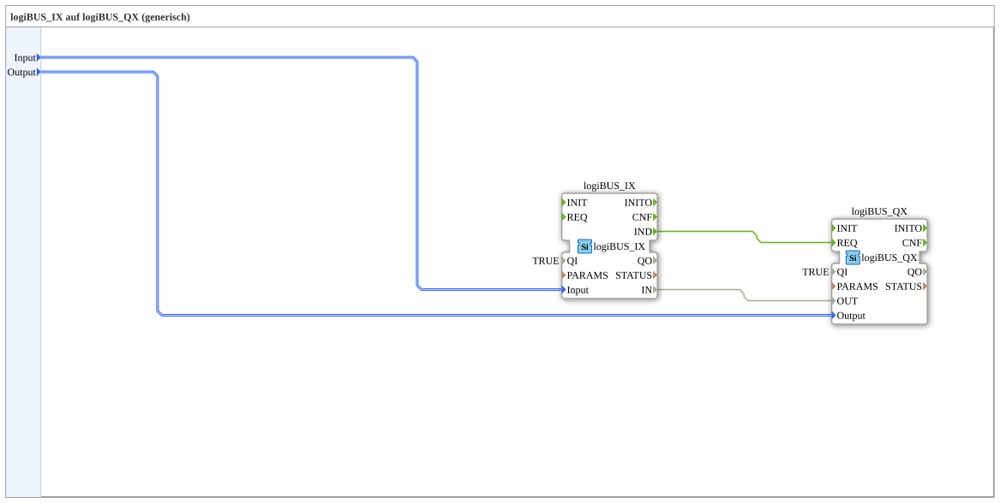

# logiBUS_IX_TO_logiBUS_QX

* * * * * * * * * *
## Introduction

`logiBUS_IX_TO_logiBUS_QX` wires a physical digital input (`logiBUS_IX`) directly to a physical digital output (`logiBUS_QX`) — functionally equivalent to [`logiBUS_IXA_TO_logiBUS_QXA`](./logiBUS_IXA_TO_logiBUS_QXA.md), but using the non-adapter-based `logiBUS_IX`/`logiBUS_QX` variants: the connection is made via an explicit event connection plus a data connection instead of an adapter.

## Function Blocks Used

### Sub-blocks: logiBUS_IX_TO_logiBUS_QX

- **Type**: SubAppType
- **Internal FBs used**:
    - **logiBUS_IX**: `logiBUS::io::DI::logiBUS_IX` — physical digital input, fires `IND` on state change, `QI=TRUE`.
    - **logiBUS_QX**: `logiBUS::io::DQ::logiBUS_QX` — physical digital output, driven via `REQ`, `QI=TRUE`.
- **Operation**: The input event `IND` directly triggers `REQ` on the output; the current state is passed through in parallel via a data connection from `IN` to `OUT`.

## Program Flow and Connections

1. `Input` → `logiBUS_IX.Input`; `Output` → `logiBUS_QX.Output`.
2. `logiBUS_IX.IND` → `logiBUS_QX.REQ` (event connection).
3. `logiBUS_IX.IN` → `logiBUS_QX.OUT` (data connection).

## Application Scenarios

- Hardware-to-hardware pass-through in training systems that (unlike `test_AX`) rely on the non-adapter-based I/O blocks `logiBUS_IX`/`logiBUS_QX`.

## Summary

Non-adapter-based counterpart to `logiBUS_IXA_TO_logiBUS_QXA`: same function, explicit event/data connection instead of adapter coupling.

---

### 🌐 Related topic subpages on ms-muc-docs.de

* [🌐 Eclipse 4diac IDE & color reference on ms-muc-docs.de](https://www.ms-muc-docs.de/iec-61499/eclipse-4diac/)
