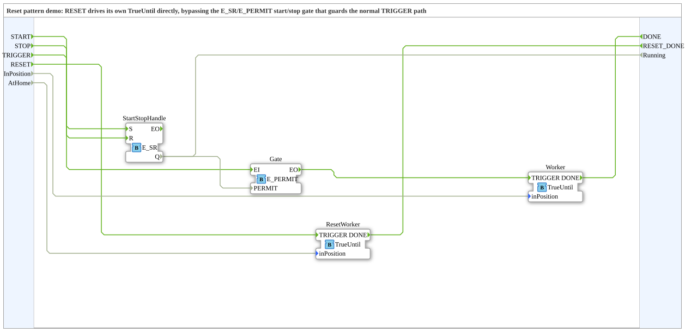

# Design Pattern: Reset

* * * * * * * * * *

## Introduction

Alongside the normal, possibly start/stop-gated operating logic, a
plant needs a **reset/homing path** that drives it back to a
safe/defined starting state. If this reset path ran through the same
start/stop `E_PERMIT` gate as the normal operating logic (see the
[Start/Stop pattern](StartStopPattern.md)), the plant couldn't be reset
while stopped — but that's often exactly when reset matters most (e.g.
after an emergency stop, before the next start).

## Course slide reference

Slide 71 – *"The reset pattern"* (category: Compositional /
Architectural). Shows the same cylinder example graphic as the
handshake/start-stop patterns, with its own `CylinderReset` branch,
triggered directly by an external `RESET` event — **not** through the
start/stop pattern's `E_PERMIT` gate.

## Solution: an architecturally separate reset path

The reset path is kept **architecturally separate** from the normal
operating logic — its own, direct trigger input (`RESET`) that does
**not** run through the `E_PERMIT` gate, but triggers the relevant
action immediately and unconditionally.

## Demo: `ResetDemo`

**No new blocks** — reuses [`TrueUntil`](ChainOfActionsPattern.md) for
the reset block itself, with no gate in front of it. Combines the
start/stop pattern (`START`/`STOP` → `E_SR` → `E_PERMIT` →
`Worker.TRIGGER`, as in `StartStopDemo`) with a **separate, ungated**
`RESET` → `ResetWorker.TRIGGER` path, to make the architectural point
explicit: reset works even while the plant is stopped
(`E_SR.Q=FALSE`), whereas the normal `TRIGGER` does not.

## Summary

Reset shows that not every signal path may run through the same gate —
a safety/homing path must work independently of the start/stop
permission. It builds on [Start/Stop](StartStopPattern.md) and
[Chain of Actions](ChainOfActionsPattern.md) without needing a single
new block. Not yet tested in 4diac.
