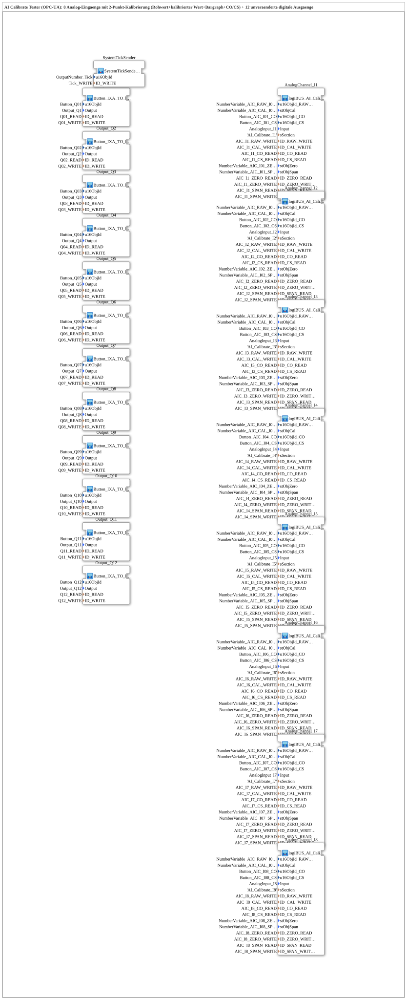

# InputOutputTesterButton_AI_Calibrate_OPC_UA: AI Calibrate Tester (OPC-UA)

* * * * * * * * * *
## Introduction

`InputOutputTesterButton_AI_Calibrate_OPC_UA` is the training example for **8 analog inputs with 2-point calibration**, controllable both via the ISOBUS Virtual Terminal and via OPC-UA (web client). The 12 digital outputs are carried over unchanged from the [`InputOutputTesterButton_DIDO_OPC_UA`](../Button_DIDO_OPC_UA/InputOutputTesterButton_DIDO_OPC_UA.md) example; the only new part is the calibration logic for the 8 analog inputs.

Unlike DIDO/PWM, the actual calibration logic per channel is substantially larger: each analog input runs a full 2-point calibration (reference values ZERO/SPAN, triggered via two VT/OPC-UA buttons CO/CS), whose result (OFFSET/SCALE) is persisted to INI storage so the calibration survives a controller restart.

## Function Blocks (FBs) Used

| SubApp instance | Type | Purpose |
|---|---|---|
| `AnalogChannel_I1` … `AnalogChannel_I8` | `MyLib::sys::logiBUS_AI_Calibrate_IDA_OPC` | Analog input with 2-point calibration, VT number fields (raw + calibrated) + bargraph + OPC-UA |
| `Output_Q1` … `Output_Q12` | `MyLib::sys::Button_IXA_TO_logiBUS_QXA_BG_OPC` | Digital output, unchanged from the DIDO example |
| `SystemTickSender` | `MyLib::sys::SystemTickSender` | Cyclic counter feeding the VT status display (`OutputNumber_Tick`) |

### Sub-block: `logiBUS_AI_Calibrate_IDA_OPC` (analog inputs)

*Not yet documented in the library reference (`MyLib_AX-1.0.0::sys`) — a separate doc gap, see the note at the end of this page.*

- **Type**: SubAppType (`MyLib::sys`), source-block comment: *"logiBUS_AI_IDA (analog input) with 2-point calibration (AR_CALIBRATE_SQ_REF, OFFSET/SCALE + reference values ZERO/SPAN, all INI-persisted) onto VT number fields (raw + calibrated value, each its own CNumberVariable) + bargraph (calibrated) + 2 VT buttons (CO/CS) + OPC-UA (raw value DWORD + calibrated value REAL, generic, one channel)"*
- **Functionality**: The physical analog input (`logiBUS_AI_IDA`) feeds, through a chain of `AD_SPLIT_2`/`AD_TO_AUDI`/`AUDI_SPLIT_2`, both the uncalibrated raw value (VT display + OPC-UA publish via `AD_PUBLISH_1`) and the input to the actual calibration (`AUDI_TO_AR` → `AR_CALIBRATE_SQ_REF` adapter). Two VT/OPC-UA buttons (`Button_CO`, `Button_CS`) each trigger — via `E_MERGE` event-merging of a local button press and an OPC-UA remote trigger (`AX_SUBSCRIBE_1` → `AX_RF_TRIG`, edge detection for the web client's toggle mechanism) — one of the two calibration steps CO (zero point) and CS (span) on the `CALIBRATE` adapter. The result (`OFFSET`, `SCALE`) is persisted via one `INI_AR2` block each (default `OFFSET=0.0`, `SCALE=1.0`), as are the two reference values `ZERO`/`SPAN` (default `0.0`/`100.0`). The calibrated value (`CALIBRATE.Y`) goes via `AR_SPLIT_2` both to the VT/OPC-UA display (`AR_PUBLISH_1`) and to the VT number field with bargraph (`Q_NumericValue_PHYSA`).
- **Reference values settable from the outside**: The ZERO/SPAN reference values themselves are writable both via a VT input field and via OPC-UA, through two `MyLib::sys::NumericValue_TO_AR2_OPC` sub-blocks (`Y_OFFSET_LIT`, `Y_SCALE_LIT` — names are historical leftovers from an earlier iteration; they actually feed the ZERO/SPAN values into `CALIBRATE.Y_Offset`/`CALIBRATE.Y_Scale`) — unlike DIDO/PWM, it's not just outputs but also calibration parameters that are bidirectionally changeable from both VT and web here.
- **Calibration method**: Uses `AR_CALIBRATE_SQ_REF` rather than the simpler `AR_CALIBRATE` (see [`AR_CALIBRATE_SQ`](https://docs.ms-muc-docs.de/projects/4diac-library-reference-docs/en/latest/ExternalLibraries/adapter/Engineering/measurements/AR_CALIBRATE_SQ/) in the library reference) — per the block's own version note, modeled on an earlier exercise but with a corrected offset formula and an ECC-enforced CO-before-CS order (span can only be calibrated after the zero point).

### Sub-block: [Button_IXA_TO_logiBUS_QXA_BG_OPC](https://docs.ms-muc-docs.de/projects/4diac-library-reference-docs/en/latest/typelibrary/MyLib/sys/Button_IXA_TO_logiBUS_QXA_BG_OPC/) (outputs)

Unchanged from the DIDO example — see its own description there.

## VT Integration (ISOBUS Virtual Terminal)

The associated VT pool project `Workspace_AI_Calibrate` (ISO-Designer, `DefaultPool.jop`) consists of 5 DataMasks:

| Mask | ObjectID | Content |
|---|---|---|
| `DataMask_M1` | 1000 | Overview/start mask (480×480), entry point for the 4 channel masks |
| `DataMask_AIC1` … `DataMask_AIC4` | 1001–1004 | **2 analog channels** each: raw value display, calibrated value, bargraph, 2 CO/CS buttons, and 2 input fields for the per-channel ZERO/SPAN reference values |

The numeric VT objects (`NumberVariable_AIC_RAW_I0n`, `NumberVariable_AIC_CAL_I0n_N`, `NumberVariable_AIC_I0n_ZERO_N`/`_SPAN_N`, `Button_AIC_I0n_CO`/`_CS`) are — as with every VT exercise in this system — translated from the compiled `DefaultPool.iop.h` into a 4diac `.gcf` constants file (`Uebungen::const::UT::AIC::DefaultPool_AIC`) via `GcfScript.py`, and imported into the FB networks from there (see `test_AX/scripts/RunSkript_Workspace_AI_Calibrate_AX.{bat,sh}`).

## Web Client (OPC-UA, not a VT pixel mirror)

The web client `apixon-ai-calibrate-client` (Vue 3, `ApixonAICalibrate.vue`) is **not** a visual replica of the DataMasks (unlike a `vt-ui-mirror` project) — it's a standalone, functional web UI that connects directly via WebSocket OPC-UA (`OPCUAClient`, default port `4841`) to the FORTE runtime and subscribes to/writes the same nodes as the FB networks (raw value, calibrated value, CO/CS toggle, per-channel ZERO/SPAN reference values) — independent of the VT masks' layout.

## Program Flow and Connections

1. **8 analog channels**: `AnalogChannel_I1`…`AnalogChannel_I8` read `AnalogInput_I1`…`AnalogInput_I8`, calibrate them via the 2-point method, and publish raw + calibrated value via OPC-UA (`AIC_I1_RAW_WRITE`…`AIC_I8_CAL_WRITE`); the CO/CS buttons can be triggered both locally (VT) and remotely (OPC-UA, `AIC_I*_CO_READ`/`_CS_READ`).
2. **12 digital outputs**: `Output_Q1`…`Output_Q12`, unchanged from the DIDO example.
3. **Tick generator**: `SystemTickSender` feeds the VT number field `OutputNumber_Tick` as well as the OPC-UA node `Tick_WRITE`.

**Registration in the training system**: As with all exercises in this system, no dedicated `Application` element is needed — selected via "Change Type" in the 4diac IDE on the system's single `Control` slot.

## Learning Objectives

- 2-point calibration (`AR_CALIBRATE_SQ_REF`) of an analog input with parallel VT **and** OPC-UA control, including INI persistence of the calibration parameters across a restart.
- Bidirectional remote triggering of a locally-triggered action (CO/CS buttons) via OPC-UA using edge detection (`AX_RF_TRIG`) rather than direct state takeover — the web client's toggle semantics.
- Combining a pure publish path (raw value), a bidirectional trigger (CO/CS), and bidirectionally writable parameters (ZERO/SPAN reference values) in a single block.

**Difficulty**: Intermediate to advanced
**Prerequisites**: [`InputOutputTesterButton_DIDO_OPC_UA`](../Button_DIDO_OPC_UA/InputOutputTesterButton_DIDO_OPC_UA.md) (basic VT+OPC-UA pattern), the [`AR_CALIBRATE_SQ`](https://docs.ms-muc-docs.de/projects/4diac-library-reference-docs/en/latest/ExternalLibraries/adapter/Engineering/measurements/AR_CALIBRATE_SQ/) adapter, INI persistence (`eclipse4diac::storage::INI_AR2`).

## Summary

`InputOutputTesterButton_AI_Calibrate_OPC_UA` demonstrates 2-point analog calibration with full VT and OPC-UA access to the raw value, the calibrated value, the calibration trigger, and the reference values themselves — the most complex combination of local and remote control in this training system so far.

> **Note**: The sub-block `MyLib::sys::logiBUS_AI_Calibrate_IDA_OPC` and `MyLib::sys::NumericValue_TO_AR2_OPC` live under `MyLib_AX-1.0.0` and don't yet have their own page in the library reference (`Bibliotheken/typelibrary/MyLib_AX/sys/`) — that's part of a separate, larger documentation gap for the `MyLib_AX`/`MyLib_B` library reference, not something this page addresses.

---

### 🌐 Related topic subpages on ms-muc-docs.de

* [🌐 Eclipse 4diac IDE & color reference on ms-muc-docs.de](https://www.ms-muc-docs.de/iec-61499/eclipse-4diac/)
