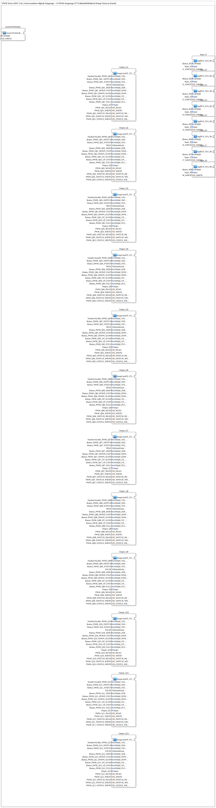

# InputOutputTesterButton_PWM_OPC_UA: PWM Tester (OPC-UA)

* * * * * * * * * *

## Introduction

`InputOutputTesterButton_PWM_OPC_UA` is the PWM training example for **12 analog outputs (0–100 % duty cycle)**, controllable both via the ISOBUS Virtual Terminal and via OPC-UA (web client). It is the direct counterpart to the existing DI/DO example `Meins::InputOutputTester::Button_DIDO_OPC_UA`: the 8 digital inputs (`Input_I1`…`Input_I8`) stay unchanged, while the previously purely digital outputs are replaced here by **12 PWM channels**, each with a VT number field, bar graph, 6 ramp buttons, a channel enable/disable switch, and a 3-color status indicator.

Since a logiBUS controller can physically drive only **8 PWM channels at the same time**, channels 1–8 are active at deployment (`bDefaultEnabled=TRUE`) while channels 9–12 start out disabled (`bDefaultEnabled=FALSE`); every channel can be switched on/off independently at any time.

The exercise is a pure top-level composite: it instantiates the 8 unchanged input blocks, 12× the PWM channel block, and one `SystemTickSender`, without containing any logic of its own.

## Function Blocks (FBs) Used

| SubApp instance | Type | Purpose |
|---|---|---|
| `Input_I1` … `Input_I8` | `MyLib::sys::logiBUS_IXA_BG_OPC` | Unchanged digital inputs, each with VT display (`Button_I01..I08`) and OPC-UA publish (`I1_WRITE..I8_WRITE`) |
| `Output_Q1` … `Output_Q12` | `MyLib::sys::RampLimitFS_TO_logiBUS_QDA_PWM_OPC` | One complete PWM channel each (VT + physical output + OPC-UA) |
| `SystemTickSender` | `MyLib::sys::SystemTickSender` | Cyclic counter feeding the VT status display (`OutputNumber_Tick`) |

All 12 `Output_Qxx` instances are the same reusable composite SubApp `RampLimitFS_TO_logiBUS_QDA_PWM_OPC` (see [sub-block](../../../../../Bibliotheken/ExternalLibraries/MyLib_AX/sys/RampLimitFS_TO_logiBUS_QDA_PWM_OPC.md) below) and differ only in their parameters:

### Sub-block: RampLimitFS_TO_logiBUS_QDA_PWM_OPC

- **Type**: SubAppType (`MyLib::sys`)
- **Instantiated 12×**, each with its own object IDs for the VT number field/bar (`u16ObjId_VALUEVAR`), the 6 ramp buttons (`u16ObjId_ZERO/DOWN_FAST/DOWN_SLOW/UP_SLOW/UP_FAST/FULL`), the channel switch (`u16ObjId_SWITCH`) and the status background color (`u16ObjId_STATUS`), the physical PWM output (`Output`, `logiBUS::io::DQ::logiBUS_DO_S`), and five OPC-UA addresses (`ID_READ`, `ID_WRITE`, `ID_SWITCH_READ`, `ID_SWITCH_WRITE`, `ID_STATUS_WRITE`).
- **Parameter `bDefaultEnabled`**: `TRUE` for channels 1–8, `FALSE` for channels 9–12 — sets the enable state at deployment, since only 8 PWM channels are physically available at once.
- **Functionality**: Merges the VT setpoint (number field/ramp buttons) and the web setpoint (OPC-UA subscribe, percent REAL) onto the same `RampLimitFS` ramp block, drives the physical `logiBUS_QD_PWM` output with a 13-bit PWM raw value, and mirrors setpoint, enable state, and actual status (`QO`) back via OPC-UA publish. See the block's own documentation for details.

### OPC-UA address space

For each channel `Qnn` (01–12), `SubStrings.gcf` creates its own folder node under `/Objects/PWM/Qnn/` (FORTE automatically creates missing intermediate folders as `FolderType` objects):

| Node path | Node ID | Direction | Meaning |
|---|---|---|---|
| `/Objects/PWM/Qnn/VALUE` | `s=PWM_Qnn` | Read+Write | Setpoint percent (REAL 0.0–100.0) |
| `/Objects/PWM/Qnn/SWITCH` | `s=PWM_Qnn_SWITCH` | Read+Write | Channel enabled/disabled (BOOL) |
| `/Objects/PWM/Qnn/STATUS` | `s=PWM_Qnn_STATUS` | Write (read-only for the client) | Actual status `logiBUS_QD_PWM.QO` (BOOL) |

The `apixon-pwm-client` web client renders each channel as a REAL slider with a number field (0–100 %) plus the combined 3-color status logic (white=disabled, green=active+OK, red=active+fault) from the same two already-published bits `SWITCH`/`STATUS`.

## Program Flow and Connections

The exercise itself contains **no connections** (`EventConnections`/`DataConnections` are empty) — it consists solely of 21 SubApp instances running in parallel, wired to the physical hardware and the OPC-UA addresses purely through `Parameter` assignments:

1. **8 unchanged inputs**: `Input_I1`…`Input_I8` read the physical inputs `Input_I1`…`Input_I8` and mirror them via VT display (`Button_I01`…`Button_I08`) and OPC-UA publish (`I1_WRITE`…`I8_WRITE`).
2. **12 PWM channels**: `Output_Q1`…`Output_Q12` each connect one physical PWM output (`Output_Q1`…`Output_Q12`) to its own group of VT objects and OPC-UA addresses. Each instance works independently — there are no connections between channels.
3. **Tick generator**: `SystemTickSender` counts up cyclically and feeds the VT number field `OutputNumber_Tick` as well as the OPC-UA node `Tick_WRITE` — serving as a "heartbeat" of the controller on both the VT and the web UI.

**Registration in the training system**: No dedicated `Application` element is needed. The training system has exactly one `Control` slot per `System`, switched to the desired exercise type via "Change Type" in the 4diac IDE — the PWM composite is thus a selectable target without changing the system structure (`test_AX.sys`).

**VT project**: `Workspace_PWM12` provides the matching ISO-Designer objects — an overview page plus 3 data masks (`DataMask_PWM1/2/3`, 4 channels per page), each channel as a horizontal row with label, percent number field, raw-value number field, horizontal bar graph, and the 6 ramp buttons in the order `0 -- - + ++ F`.

## Value Ranges and Conversion Chains

Internally, the exercise consistently uses the SAE J1939/ISO 11783 fieldbus convention (`VALID_SIGNAL_W`, 0–64255, instead of an invented scale):

- **VT/web ↔ fieldbus**: `F_PWM_PERCENT_TO_RAW`/`F_PWM_RAW_TO_PERCENT` (SubApp, `MyLib::sys`) convert between fraction 0.0–1.0 and fieldbus raw value 0–64255.
- **Percent ↔ fraction**: `F_PERCENT_TO_FRACTION`/`F_FRACTION_TO_PERCENT` (FBType, `logiBUS::signalprocessing::fieldbus`) convert between percent 0–100 and fraction 0.0–1.0 — needed because OPC-UA/web communicates in percent REAL, while the internal conversion blocks work with a 0.0–1.0 fraction.
- **Fieldbus ↔ physical PWM output**: `logiBUS_QD_PWM.OUT` expects a raw 13-bit value (0–8191), so the channel block additionally applies `×8191 / 64255`.

## Learning Objectives

- Understand how a training example with many identical channels is built from **a single reusable composite SubApp** (instead of copy-pasted logic) — here, 12× `RampLimitFS_TO_logiBUS_QDA_PWM_OPC` with different parameterization.
- Handle **analog (PWM) outputs** as opposed to purely digital outputs (`Button_DIDO_OPC_UA`), including setpoint ramping, scaling chains, and the 13-bit raw value format.
- Bidirectional **OPC-UA synchronization** of an analog setpoint (VT ↔ web, with a multi-source mux via `E_RS`+`F_SEL`) as well as a channel enable switch.
- Represent physical hardware limits (max. 8 simultaneous PWM channels) in software via an individually switchable enable state.

**Difficulty**: Advanced
**Prerequisites**: `Button_DIDO_OPC_UA` (digital counterpart), `Uebung_094a` (QI-based enable instead of PERMIT), basics of `RampLimitFS` and OPC-UA adapters (`AR_SUBSCRIBE_1`/`AR_PUBLISH_1`, `AX_SUBSCRIBE_1`/`AX_PUBLISH_1`).

## Summary

`InputOutputTesterButton_PWM_OPC_UA` demonstrates how a complete 12-channel PWM training example with VT and web control can be built purely by instantiating a single, well-encapsulated channel block (`RampLimitFS_TO_logiBUS_QDA_PWM_OPC`) multiple times. All the actual complexity — setpoint ramping, scaling between percent/fraction/fieldbus raw value/13-bit PWM, multi-source muxing between VT and web, and the 3-color status logic — lives entirely inside this sub-block; the top-level exercise itself remains a pure parameterization and wiring list.

---

### 🌐 Related topic pages on ms-muc-docs.de

- [🌐 Eclipse 4diac IDE & color reference on ms-muc-docs.de](https://www.ms-muc-docs.de/iec-61499/eclipse-4diac/)
