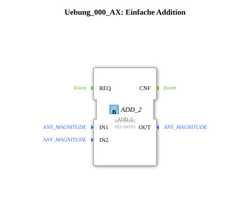

# Exercise_000_AX: Simple Addition

[(https://notebooklm.google.com/notebook/041f4df4-b729-484d-b786-b6dcdf151961)
This article describes the logiBUS® exercise `Uebung_000_AX`, the absolute basic example for calculations.
----
## Objective of the Exercise

The objective is to place and parameterize a standard function block from the IEC 61131 library within an IEC 61499 network.

-----

## Description and Components

[cite_start]The subapplication `Uebung_000_AX.SUB` contains only one calculation function block[cite: 1].

### Function Blocks (FBs)

* **`ADD_2`**: Type `iec61131::arithmetic::ADD_2`. [cite_start]Adds two integers (`IN1` and `IN2`)[cite: 1].

----

## Functionality

The block is permanently configured with the values 5 and 3. The result (8) is output at `OUT`. Since this is a simple data block without an event input, the result is calculated as soon as the input data changes.

-----

## Application Example

Basis for any type of **counters, offsets, or scaling** in a controller.