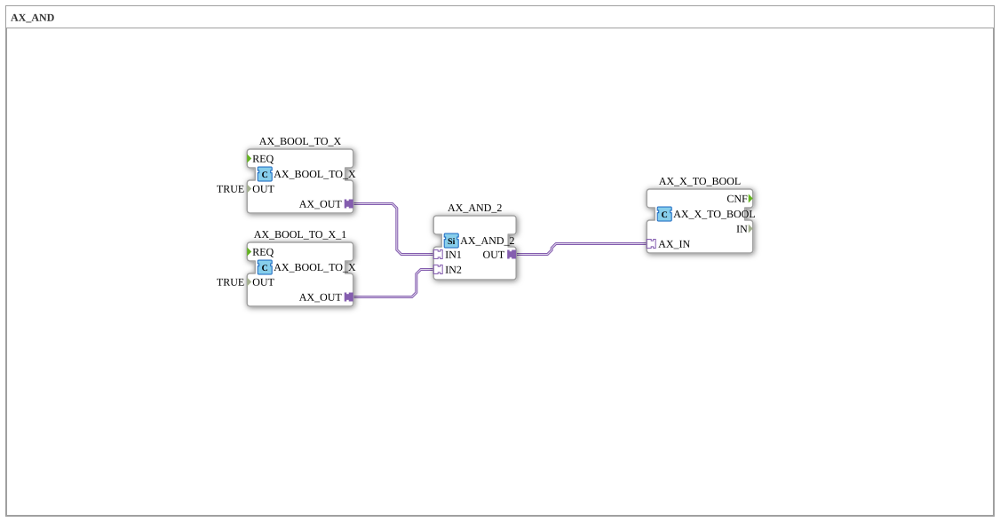

# Exercise_000b_AX: AX_AND

* * * * * * * * * *
This exercise demonstrates the use of **adapter function blocks** to implement a logical AND operation. Within the sub-app, Boolean values are exchanged between conversion blocks and a logical AND block via adapter connections. You will learn the basic structure of adapters and how they interact within a sub-app.
The exercise represents a simple AND logic operation where two constant **TRUE** values are combined using the `AX_AND_2` function block. The result is output via another converter.

The sub-app consists of three internal function blocks:

## Function Blocks Used (FBs)
## Introduction
### AX_BOOL_TO_X (instantiated twice)
- **Type**: `adapter::conversion::unidirectional::AX_BOOL_TO_X`
- **Parameters**:
- `OUT` = `TRUE` (sets the output to the value **TRUE**)
- **Function**: Converts a Boolean value (via parameter or input) to the adapter data type `X`. In this exercise, the output is directly set to `TRUE`, so the block functions as a constant generator.
- **Connections**:
- `AX_BOOL_TO_X.AX_OUT` → `AX_AND_2.IN1`
- `AX_BOOL_TO_X_1.AX_OUT` → `AX_AND_2.IN2`

### AX_AND_2
- **Type**: `adapter::booleanOperators::AX_AND_2`
- **Parameters**: None
- **Function**: Performs a logical AND operation on the two inputs (`IN1`, `IN2`). The output (`OUT`) is set after the AND operation is completed.
- **Connections**:
- Inputs: from `AX_BOOL_TO_X` (IN1) and `AX_BOOL_TO_X_1` (IN2)
- Output (`OUT`) → `AX_X_TO_BOOL.AX_IN`

### AX_X_TO_BOOL
- **Type**: `adapter::conversion::unidirectional::AX_X_TO_BOOL`
- **Parameters**: None
- **Function**: Converts a value of the adapter data type `X` back into a Boolean value. This represents the output of the entire circuit.
- **Connections**:
- Input (`AX_IN`) of `AX_AND_2.OUT`

The sub-app has no external interfaces (no inputs/outputs at the sub-app level). All logic is hard-wired internally:

1. Two `AX_BOOL_TO_X` blocks constantly output the value **TRUE**.

2. These values are passed to the two inputs of the `AX_AND_2` block via adapter connections.

3. The `AX_AND_2` block calculates the AND operation: `TRUE AND TRUE = TRUE`.

4. The result is forwarded via an adapter connection to the `AX_X_TO_BOOL` block, which converts the value back into a Boolean value.

Since all input values are `TRUE`, the output of the `AX_X_TO_BOOL` block is always **TRUE**. In an extended application, the constant values could be replaced by external signals by adding appropriate adapter interfaces to the sub-app.

**Learning Objectives**:

- Understanding how adapters interact in 4diac.
- Understanding the difference between data flows and adapter connections.
- Understanding the fundamentals of Boolean logic with `AX_AND_2`.

**Difficulty Level**: Easy

**Prerequisites**: Basic operation of the 4diac IDE, knowledge of the block types "adapter" and "function block".

**Implementation**: The exercise can be tested in a simulation without external signals – the output remains constant TRUE. To process dynamic values, the constant `AX_BOOL_TO_X` function blocks would need to be replaced with adapter inputs.

The exercise `Uebung_000b_AX` demonstrates a simple AND logic function implemented exclusively with adapter function blocks. It illustrates the necessity of data type conversions (`AX_BOOL_TO_X` and `AX_X_TO_BOOL`) and the direct connection of adapter outputs to adapter inputs. By using constant values, the fundamental behavior is demonstrated, which can later be extended to include dynamic signals.

The exercise `Uebung_000b_AX` demonstrates a simple AND logic function implemented entirely with adapter function blocks. ---

* [🌐 Eclipse 4diac IDE & Color Reference on ms-muc-docs.de](https://www.ms-muc-docs.de/iec-61499/eclipse-4diac/)

]

## Program Flow and Connections
## Summary
### 🌐 Passende Themen-Unterseiten auf ms-muc-docs.de