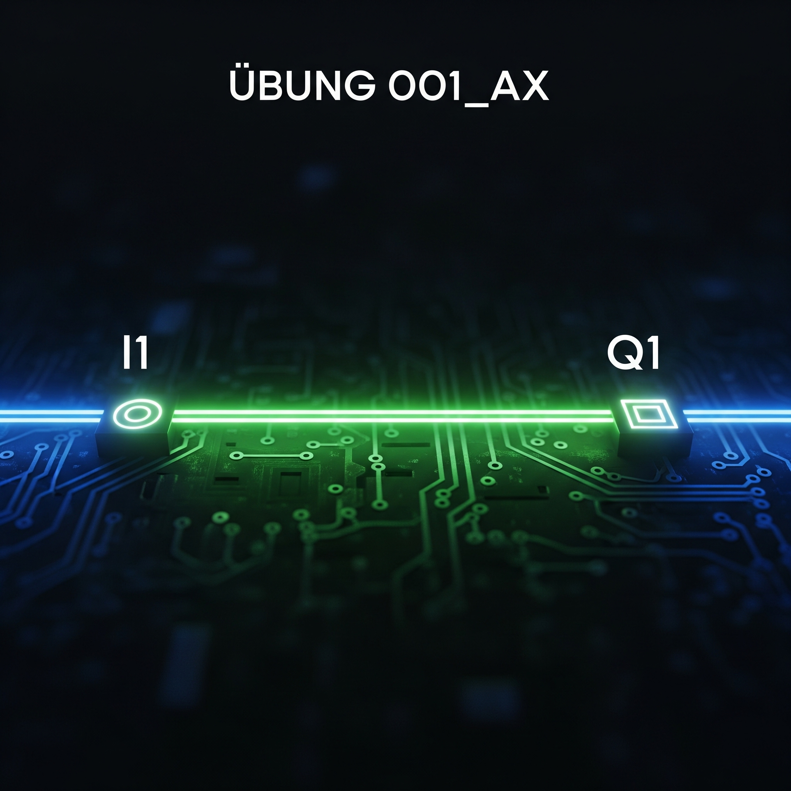
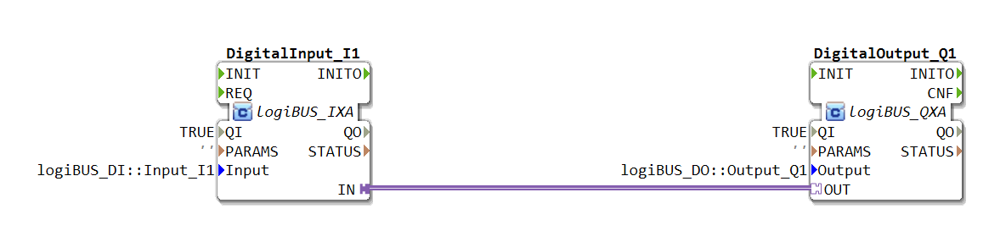
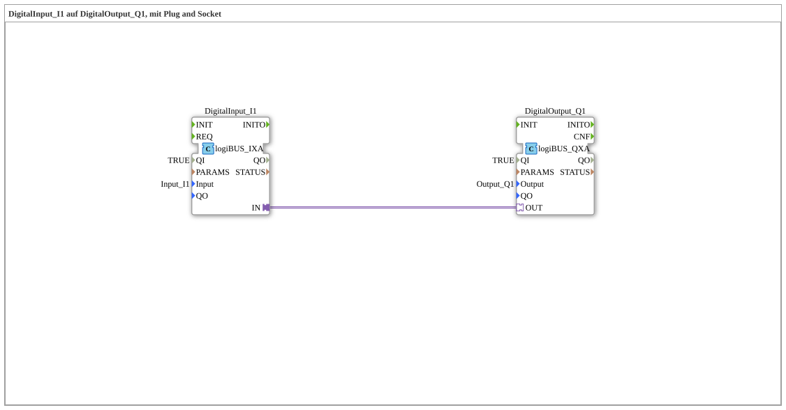

# Exercise_001_AX: DigitalInput_I1 to DigitalOutput_Q1, using Plug and Socket

[](https://notebooklm.google.com/notebook/041f4df4-b729-484d-b786-b6dcdf151961)

This article describes the basic logiBUS® exercise `Uebung_001_AX`, in which a digital input is directly connected to a digital output using the AX adapter.

----





## Objective of the Exercise

The main objective of this exercise is to demonstrate the basic principle of direct signal transmission from a physical digital input to a physical digital output. This is achieved using the "Plug and Socket" concept of IEC 61499 via an adapter interface. The logic is quite simple: The state of the output should always correspond to the state of the input.


# -----

## Description and Components

[cite\_start]The exercise consists of a sub-application (`Uebung_001_AX.SUB`) that links two function blocks via an adapter connection[cite: 1]. [cite\_start]The adapter type `AX.adp`[cite: 2] serves as the interface for this connection.

### Function Blocks (FBs)

Two central function blocks are instantiated in the sub-application:



* **`DigitalInput_I1`**: An instance of type `logiBUS_IXA`. This block represents a physical digital input. [cite\_start]It is hardwired to the hardware input `logiBUS_DI::Input_I1` via the parameter `Input`[cite: 1].

* **`DigitalOutput_Q1`**: An instance of type `logiBUS_QXA`. This block represents a physical digital output. Its parameter `Output` references the hardware output `logiBUS_DO::Output_Q1`.

### Adapter Interface: `AX.adp`

The connection between the two blocks is implemented using the adapter type `AX`. This is a unidirectional interface defined to transmit exactly one event and its corresponding Boolean value.


### Adapter Interface: `AX.adp`

The connection between the two blocks is implemented using the adapter type `AX`. This is a unidirectional interface defined to transmit exactly one event and its corresponding Boolean value. * [cite\_start]**Event `E1`**: An event that signals a change of state[cite: 2].

* [cite\_start]**Variable `D1` (BOOL)**: The Boolean value (true/false) sent with the event `E1`[cite: 2].

-----

## Functionality

The logic is implemented solely through the connection of the two components. In the subapplication `Uebung_001_AX.SUB`, the "plug" of the input component is connected to the "socket" of the output component:


```xml
<AdapterConnections>
    <Connection Source="DigitalInput_I1.IN" Destination="DigitalOutput_Q1.OUT"/>
</AdapterConnections>
```


This single line of code implements the entire functionality:

1. The function block `DigitalInput_I1` continuously reads the state of the physical input `Input_I1`.

2. As soon as the state of the input changes, the function block sends the event `E1` along with the current Boolean state (`D1`) via its `IN` adapter connection (the "plug").

3. The function block `DigitalOutput_Q1` receives this event and the data value at its `OUT` connection (the "socket").

4. Immediately after receiving the signal, the `DigitalOutput_Q1` block sets the physical output `Output_Q1` to the received value from `D1`.

As a result, the **digital output Q1** reflects the state of the **digital input I1** exactly and in real time.

-----

## Application Example

This configuration is the simplest form of a control application and often serves as a "Hello World" example for hardware integration in logiBUS®. A practical use case would be a simple **functional test** of the wiring:

* A switch is connected to `Input_I1`.

* A lamp is connected to `Output_Q1`.

When the switch is activated, the lamp must light up immediately. This confirms that both the input and output channels are correctly configured and wired.