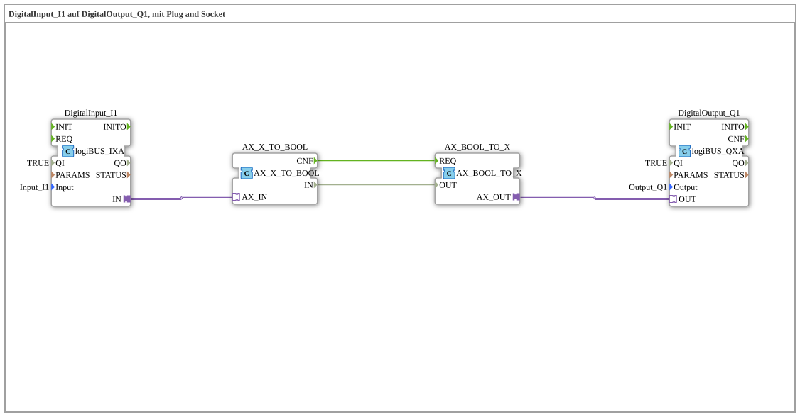

# Exercise_001_AX_b: DigitalInput_I1 to DigitalOutput_Q1, using Plug and Socket
[](https://notebooklm.google.com/notebook/041f4df4-b729-484d-b786-b6dcdf151961)
This article describes the logiBUS® exercise `Uebung_001_AX_b`, in which a digital input is connected to a digital output via signal conversion. Unlike a direct adapter connection, here the adapter state is explicitly converted to a Boolean value and back again.
----
## Objective of the Exercise
The main objective of this exercise is to demonstrate the conversion between adapter interfaces ("Plug and Socket") and classic Boolean data connections. This is a fundamental technique in IEC 61499 for making signals transmitted via adapters accessible for logical operations (such as AND, OR, NOT) that operate on elementary data types.

-----

## Description and Components

[cite_start]This exercise is based on the sub-application `Uebung_001_AX_b.SUB`, which implements the signal flow from a digital input to a digital output via two intermediate converter ICs[cite: 1].

### Function Blocks (FBs)

Four function blocks are instantiated in the sub-application:



* **`DigitalInput_I1`**: An instance of type `logiBUS_IXA`. [cite_start]This block reads the state of the physical input `Input_I1` and makes it available via its adapter connection `IN`[cite: 1].

`` * **`DigitalOutput_Q1`**: An instance of type `logiBUS_QXA`. [cite_start]This component receives signals at its adapter input `OUT` and sets the corresponding physical output `Output_Q1`[cite: 1].

* **`AX_X_TO_BOOL`**: [cite_start]A converter component that decomposes a signal received at the adapter input `AX_IN` (socket) into an event `CNF` and a Boolean data value `IN`[cite: 1].
* **`AX_BOOL_TO_X`**: [cite_start]A converter module that reassembles an adapter signal at output `AX_OUT` (Plug) from an event `REQ` and a Boolean data value `OUT`[cite: 1].

### Adapter Interface: `AX.adp`

[cite_start]As in the basic exercise, the adapter type `AX` serves as the interface here as well, transmitting the event `E1` and the Boolean value `D1`[cite: 2].

-----

## Functionality

The logic is implemented through the combination of adapter, event, and data connections. The signal path is defined in the file `Uebung_001_AX_b.SUB` as follows:

`````xml
<EventConnections>
<Connection Source="AX_X_TO_BOOL.CNF" Destination="AX_BOOL_TO_X.REQ"/>
</EventConnections>
<DataConnections>
<Connection Source="AX_X_TO_BOOL.IN" Destination="AX_BOOL_TO_X.OUT"/>
</DataConnections>
<AdapterConnections>
<Connection Source="DigitalInput_I1.IN" Destination="AX_X_TO_BOOL.AX_IN"/>
<Connection Source="AX_BOOL_TO_X.AX_OUT" Destination="DigitalOutput_Q1.OUT"/>
</AdapterConnections>

The process is as follows:

1. If the state at input `I1` changes, `DigitalInput_I1` sends an adapter event.

2. The function block `AX_X_TO_BOOL` receives this event, outputs the current state at data output `IN`, and signals this with the event `CNF`.

3. The event `CNF` triggers the `REQ` input of `AX_BOOL_TO_X`, which then adopts the value from `OUT`.

4. `AX_BOOL_TO_X` sends a new adapter event to `DigitalOutput_Q1`, which then switches the output `Q1`.

-----

## Application Example

This configuration serves as preparation for more complex control tasks. A practical example would be **signal inversion**:

If you want the lamp on `Q1` to light up when the switch on `I1` is *not* activated, you can simply insert a `NOT` function block between the converter blocks. The Boolean signal from `AX_X_TO_BOOL.IN` is inverted and then passed to `AX_BOOL_TO_X.OUT`. This demonstrates the flexibility gained by converting adapters into elementary data types.
