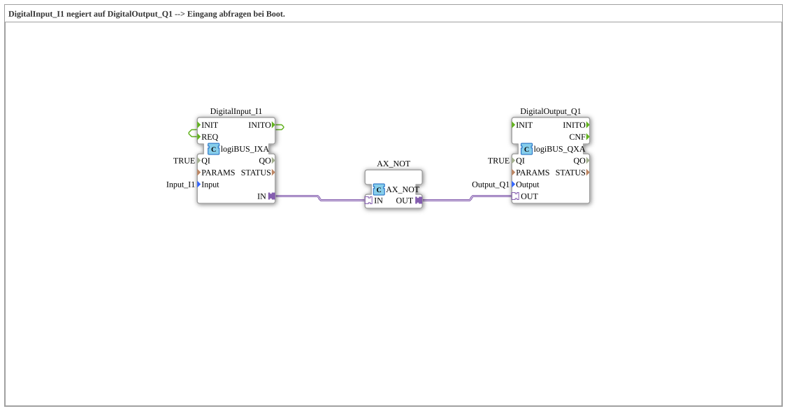

# Exercise_001c2_AX: DigitalInput_I1 negated to DigitalOutput_Q1 --> Input query on boot

* * * * * * * * * *

## Introduction

This exercise demonstrates the negation of a digital input signal to a digital output using a logic negation adapter. Particular emphasis is placed on the initial behavior after the controller boots: event feedback ensures that the output immediately assumes the correct negated state of the input.

## Function Blocks (FBs) Used

- **DigitalInput_I1** (Type: `logiBUS::io::DI::logiBUS_IXA`):

Reads the physical digital input `Input_I1`.

*Parameters*: `QI = TRUE` (initialization active), `Input = "Input_I1"`.

- **DigitalOutput_Q1** (Type: `logiBUS::io::DQ::logiBUS_QXA`):

Sets the physical digital output `Output_Q1`.

*Parameters*: `QI = TRUE`, `Output = "Output_Q1"`.

- **AX_NOT** (Type: `adapter::booleanOperators::AX_NOT`):

An adapter function block that negates the Boolean value applied to its `IN` adapter and outputs it to the `OUT` adapter.

## Program Flow and Connections

The data flow is implemented at the adapter level:

1. The digital input `DigitalInput_I1` provides the status of the physical input as an adapter signal at its `OUT` connection.
2. This signal is directly forwarded to the `IN` adapter of the negation block `AX_NOT`.
3. The negated value exits `AX_NOT` via the `OUT` adapter and is passed to the `OUT` adapter of the output block `DigitalOutput_Q1`.
4. `DigitalOutput_Q1` sets the physical output accordingly.

**Special Feature – Initialization Behavior (Boot):**

An event connection between the event output `INITO` of `DigitalInput_I1` and the event input `REQ` of the same function block ensures that the input is polled immediately after initialization (during boot). Without this connection, the output would initially be `FALSE` after startup, as the event chain would first have to be triggered by an external event. The feedback mechanism reads the current input value and sets the output correctly.

**Learning Objectives:**

- Understanding event control in 4diac (event feedback for initialization).
- Application of adapter blocks for signal processing (negation).
- Simple interaction of digital inputs and outputs.

## Summary

Exercise `Uebung_001c2_AX` demonstrates a basic circuit for negating a digital input to an output. By cleverly utilizing event feedback, the output is set to the correct value as soon as the controller starts, thus increasing the application's robustness. The components used (digital input, negation adapter, digital output) are typical components of the logiBUS library and can be flexibly integrated into more complex automation solutions.

---

### 🌐 Related topic subpages on ms-muc-docs.de

- [🌐 Eclipse 4diac IDE & color reference on ms-muc-docs.de ](https://www.ms-muc-docs.de/iec-61499/eclipse-4diac/)
