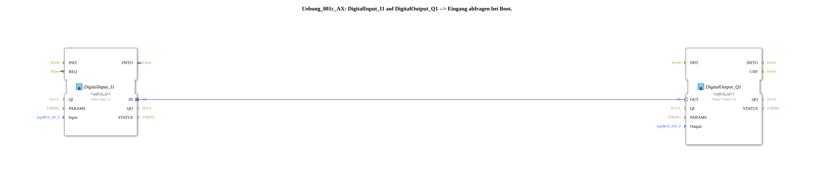

# Exercise_001c_AX: DigitalInput_I1 to DigitalOutput_Q1 --> Query input at boot.
[](https://notebooklm.google.com/notebook/041f4df4-b729-484d-b786-b6dcdf151961)
This article describes the logiBUS® exercise `Uebung_001c_AX`. It demonstrates how to query a digital input immediately after system startup (boot process) to transmit the initial state to a digital output.
----
## Objective of the exercise
The main objective of this exercise is to understand the initialization process in IEC 61499. In many automation scenarios, it is not sufficient to simply react to state changes; the system must also capture the current state of the hardware at startup to ensure a defined initial state.

[](https://notebooklm.google.com/notebook/041f4df4-b729-484d-b786-b6dcdf151961)] -----

## Description and Components

[cite_start]This exercise uses the subapplication `Uebung_001c_AX.SUB` to establish a connection between a digital input and an output, supplemented by self-triggering for system startup[cite: 1].

### Function Blocks (FBs)

Two central function blocks are used in the subapplication:



* **`DigitalInput_I1`**: An instance of type `logiBUS_IXA`. [cite_start]In addition to the standard function, the event output `INITO` (Initialization Output) is used here to trigger a one-time query at startup[cite: 1].
* **`DigitalOutput_Q1`**: An instance of type `logiBUS_QXA`. [cite_start]This function block receives the initially requested value via the adapter connection and sets the output `Output_Q1` accordingly[cite: 1].

### Adapter Interface: `AX.adp`

[cite_start]Communication between the function blocks takes place via the familiar adapter type `AX`, which transmits the event `E1` and the data value `D1`[cite: 2].

-----

## Functionality

The special feature of this exercise lies in the event connection, which provides feedback for the initialization process. The structure in the file `Uebung_001c_AX.SUB` is as follows:

```xml
<EventConnections>
<Connection Source="DigitalInput_I1.INITO" Destination="DigitalInput_I1.REQ"/>
</EventConnections>
<AdapterConnections>
<Connection Source="DigitalInput_I1.IN" Destination="DigitalOutput_Q1.OUT"/>
</AdapterConnections>

[cite_start][cite: 1]

The functional sequence is as follows:

1. **System Startup**: When the 4diac runtime environment starts up, the function block `DigitalInput_I1` is initialized.

2. **Initialization Event**: After successful initialization, the function block sends a `INITO` event.

3. **Self-Triggering**: Since `INITO` is connected to its own `REQ` input, the function block is immediately prompted to read the physical state of the `Input_I1` input.

4. **Signal Forwarding**: The read value is sent via the adapter `IN` to `DigitalOutput_Q1`, which updates the output `Q1` to the correct state during boot.

Without this `INITO -> REQ` connection, the output would only be updated when the input state changes for the first time *after* startup.

-----

## Application Example

A practical example is **state synchronization after a power failure**:

Imagine a controller that operates a ventilation flap based on the position of a switch. When the controller restarts, it must immediately know the switch position to control the flap correctly, even before the operator operates the switch again. The boot query ensures that the software state and hardware are synchronized from the very first second.

---

### 🌐 Related topic subpages on ms-muc-docs.de
* [🌐 Eclipse 4diac IDE & Color Reference on ms-muc-docs.de](https://www.ms-muc-docs.de/iec-61499/eclipse-4diac/)

]
