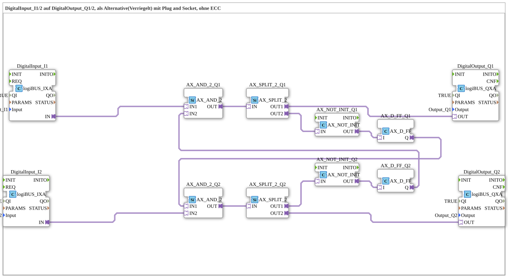

# Exercise_001d2_AX: DigitalInput_I1/2 to DigitalOutput_Q1/2, as an alternative (interlocked) connection using plug and socket, without ECC

* * * * * * * * * *
## Introduction

This exercise implements an alternative, interconnected control of two digital outputs (Q1, Q2) using two digital inputs (I1, I2). The circuit uses an interlocked (mutually exclusive) connection with logic gates and flip-flops, but without an explicit ECC (Execution Control Chart). It serves as an example of a more complex coupling of input and output signals based on the logiBUS IO system.
The circuit processes the inputs in such a way that only one of the two outputs can be active at any given time. Which input controls the output is determined by the internal logic, with the feedback of the flip-flop states implementing mutual blocking.

## Function Blocks (FBs) Used

- **DigitalInput_I1**, **DigitalInput_I2**:

Type: `logiBUS::io::DI::logiBUS_IXA`

Parameterization:

- `QI` = TRUE (enabled)
- `Input` = `Input_I1` or `Input_I2` (logiBUS channel)

These blocks provide the physical digital inputs (e.g., from a button or sensor) as Boolean signals in the system.

- **DigitalOutput_Q1**, **DigitalOutput_Q2**:

Type: `logiBUS::io::DQ::logiBUS_QXA`

Parameterization:

- `QI` = TRUE
- `Output` = `Output_Q1` or `Output_Q2`

These control the physical digital outputs (e.g., lamps or relays).

- **AX_AND_2_Q1**, **AX_AND_2_Q2**:

Type: `adapter::booleanOperators::AX_AND_2`

Parameters: none (default configuration)

Implements a logical AND operation with two inputs (IN1, IN2) and one output (OUT).

- **AX_SPLIT_2_Q1**, **AX_SPLIT_2_Q2**:

Type: `adapter::events::unidirectional::AX_SPLIT_2`

An event splitter that distributes an incoming event (IN) to two outputs (OUT1, OUT2). Used to simultaneously provide a signal to two subsequent function blocks.

- **AX_NOT_INIT_Q1**, **AX_NOT_INIT_Q2**:

Type: `adapter::booleanOperators::AX_NOT_INIT`

A logical negation (NOT) whose output state must be initialized at startup. Converts a logical signal into its inverse.

- **AX_D_FF_Q1**, **AX_D_FF_Q2**:

Type: `adapter::events::unidirectional::AX_D_FF`

A D flip-flop (data flip-flop). It stores the value at the data input (I) during an active clock event and outputs it at the output (Q). Used for state storage within the interlock.

## Program Flow and Connections

The circuit operates according to the following principle:

1. **Signal Conditioning**

The inputs I1 and I2 are read via the `logiBUS_IXA` function blocks and passed on as Boolean signals to the subsequent logic.

2. **AND Circuit with Feedback**
- The output of DigitalInput_I1 is fed to the first input (IN1) of `AX_AND_2_Q1`.
- The output of DigitalInput_I2 is fed to the second input (IN2) of `AX_AND_2_Q2`.
- The AND gates each receive the second input from the *output of the other* D flip-flop:
- `AX_AND_2_Q1.IN2` is connected to the output `Q` of `AX_D_FF_Q2`.
- `AX_AND_2_Q2.IN1` is connected to the output `Q` of `AX_D_FF_Q1`.

This cross-connection means that output Q1 can only be active when flip-flop Q2 is inactive (and vice versa). This creates a mutual interlock.

3. **Signal Distribution and Negation**

- The outputs of the AND gates are split into two paths by the `AX_SPLIT_2` function blocks:
- One path goes directly to the digital outputs:

AX_SPLIT_2_Q1.OUT1` → `DigitalOutput_Q1.OUT`

AX_SPLIT_2_Q2.OUT2` → `DigitalOutput_Q2.OUT`

- The other path goes via negation (`AX_NOT_INIT`) to the D flip-flops:

AX_SPLIT_2_Q1.OUT2` → `AX_NOT_INIT_Q1.IN` → `AX_D_FF_Q1.I`

AX_SPLIT_2_Q2.OUT1` → `AX_NOT_INIT_Q2.IN` → `AX_D_FF_Q2.I`

The negation ensures that the flip-flop stores the inverted value of the AND output at the next clock cycle, enabling mutual synchronization.

4. **State Storage**

The D flip-flops store the negated state of their respective AND gates and provide it as a feedback signal for the AND gates on the other side.

5. **Result**

The overall system is such that only one of the two outputs (Q1 or Q2) can be active at any given time. The active output changes as soon as the corresponding input is set and the other input is reset – the internal logic handles the switching via the flip-flop states.

## Summary

This exercise demonstrates a more complex solution for the interlocked control of two outputs by two inputs using AND gates, splitters, negators, and D flip-flops. It shows how mutual exclusivity can be achieved with simple logic gates without resorting to a dedicated interlocking gate (such as ILOCK).

The comment in the source code (`Kompliziert. BESSER: ILOCK-Baustein`) indicates that a specialized ILOCK function block would solve this task much more easily. Therefore, this exercise is well-suited for understanding the functionality of flip-flop-based interlocks and for learning how to implement them manually using standard components. It assumes basic knowledge of logiBUS I/O connectivity and Boolean logic.
