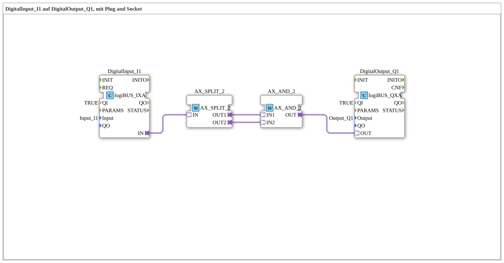

# Exercise_001d_AX: DigitalInput_I1 to DigitalOutput_Q1, using Plug and Socket

* * * * * * * * * *
## Introduction

This exercise demonstrates how to switch a digital input signal (Input_I1) to a digital output (Output_Q1).
Adapter modules (plug-and-socket) are used to couple the event and data flows between the function blocks.

The goal is to understand the basic use of adapter connections in the 4diac IDE.

## Function Blocks Used (FBs)

### DigitalInput_I1

- **Type**: `logiBUS::io::DI::logiBUS_IXA`
- **Parameters Used**:
- `QI` = `TRUE` (Enabled)
- `Input` = `Input_I1` (Physical Input)
- **Functionality**:

The block reads the state of the connected digital input **Input_I1**. When the signal changes, an event is output via the **adapter output `IN`**. The parameter `QI` must be set for the block to function.

### DigitalOutput_Q1

- **Type**: `logiBUS::io::DQ::logiBUS_QXA`
- **Parameters Used**:
- `QI` = `TRUE` (Enabled)
- `Output` = `Output_Q1` (Physical Output)
- **Functionality**:

The function block receives an event via the **adapter input `OUT`** and sets the connected digital output **Output_Q1** accordingly. The output becomes active as soon as an event occurs.

### AX_SPLIT_2

- **Type**: `adapter::events::unidirectional::AX_SPLIT_2`
- **Function**:

This adapter block distributes an incoming event to **two identical outputs** (`OUT1` and `OUT2`). It acts as a **splitter** to forward the signal in parallel to multiple subsequent blocks.

### AX_AND_2

- **Type**: `adapter::booleanOperators::AX_AND_2`
- **Function**:

This adapter block performs a **logical AND operation** on two event inputs (`IN1`, `IN2`). An event is only output at `OUT` if an event is present at both inputs simultaneously.

## Program Flow and Connections

The signal flow in the sub-application occurs exclusively via **adapter connections** (plug and socket):

1. The digital input **DigitalInput_I1** detects a change in `Input_I1` and sends an event to its adapter output `IN`.
2. This event is routed to the **AX_SPLIT_2** block, which replicates it to its two outputs `OUT1` and `OUT2`.
3. Both outputs are connected to the inputs of the **AX_AND_2** block (`IN1` and `IN2`).

Since both inputs receive the same event simultaneously, the AND gate always results in an event at output `OUT`.

4. The output event of `AX_AND_2` is transferred to the adapter input `OUT` of the **DigitalOutput_Q1** module, which then sets the physical output **Output_Q1**.

As a result, the digital input **I1** is directly mapped to the digital output **Q1**. The intermediate `AX_SPLIT_2` and `AX_AND_2` serve only to demonstrate adapter connections and have no logical effect on the switching behavior.

4. The output event of `AX_SPLIT_2` and `AX_AND_2` is for demonstration purposes only and has no logical effect on the switching behavior.

As a result, the digital input **I1** is directly mapped to the digital output **Q1**. The intermediate `AX_SPLIT_2` and `AX_AND_2` serves only to demonstrate adapter connections and has no logical effect on the switching behavior.
## Summary

Exercise `Uebung_001d_AX` demonstrates how to couple events between function blocks using **plug-and-socket connections** (adapter blocks) without using direct data lines.

By combining a splitter block (`AX_SPLIT_2`) and an AND block (`AX_AND_2`), simple switching is achieved. This provides a fundamental understanding of event-driven communication in the 4diac IDE and the use of adapters in automation technology.

---

### 🌐 Related topic subpages on ms-muc-docs.de

* [🌐 Eclipse 4diac IDE & color reference on ms-muc-docs.de ](https://www.ms-muc-docs.de/iec-61499/eclipse-4diac/)
