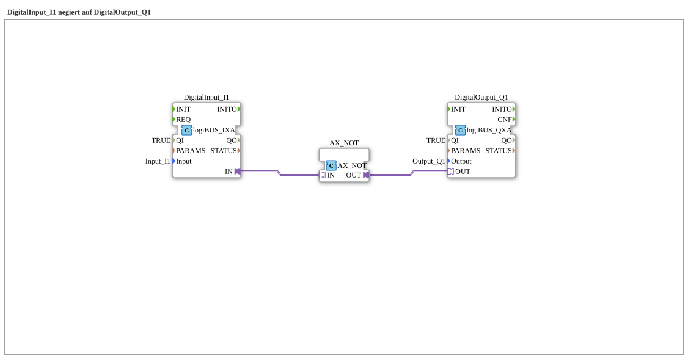

# Exercise_001e_AX: DigitalInput_I1 negated to DigitalOutput_Q1

* * * * * * * * * *
## Introduction
This exercise implements a simple Boolean negation: The state of the digital input **Input_I1** is negated and output to the digital output **Output_Q1**. It serves as an introduction to signal processing with 4diac and demonstrates the basic interconnection of an input module, a logic negation block, and an output module via adapter connections.
```
## Function Blocks Used

This exercise uses three specific function blocks from the library:

- **DigitalInput_I1**
- **Type**: `logiBUS::io::DI::logiBUS_IXA`
- **Parameters**:
- `QI` = `TRUE` (Input enabled)
- `Input` = `Input_I1` (Physical input)
- **Function**: Reads the digital state of the connected sensor (e.g., push button or switch) at input I1.
- **DigitalOutput_Q1**
- **Type**: `logiBUS::io::DQ::logiBUS_QXA`
- **Parameters**:
- `QI` = `TRUE` (Output enabled)
- `Output` = `Output_Q1` (Physical output)
- **Function**: Outputs the received logical value to digital output Q1 (e.g., to control an LED).
- **AX_NOT**
- **Type**: `adapter::booleanOperators::AX_NOT`
- **Parameters**: None
- **Function**: Performs a Boolean negation (NOT operation) on the incoming adapter data value. The output `OUT` returns the inverted value of the input `IN`.

## Program Flow and Connections

Data flows via three adapter connections (defined in the XML as `<AdapterConnections>`):

1. `DigitalInput_I1.IN` → `AX_NOT.IN`

The read state of input I1 is passed to the negation block.

2. `AX_NOT.OUT` → `DigitalOutput_Q1.OUT`

The negated value is passed to the output block.

This results in the following logic:

- If **Input_I1** `TRUE` (e.g., button pressed) → `AX_NOT` delivers `FALSE` → **Output_Q1** becomes `FALSE` (LED off).
- If **Input_I1** `FALSE` (button not pressed) → `AX_NOT` delivers `TRUE` → **Output_Q1** becomes `TRUE` (LED on).

The parameters `QI = TRUE` for the input and output modules activate them permanently. No further wiring or event controls are required.

```
## Summary

The exercise **Exercise_001e_AX** teaches the fundamentals of adapter-based communication in 4diac. It demonstrates how a digital input signal is processed with a simple logic gate (NOT) and output to a physical output. This understanding forms the basis for more complex logic operations and control tasks in automation technology.

---

### 🌐 Related topic subpages on ms-muc-docs.de
* [🌐 Eclipse 4diac IDE & color reference on ms-muc-docs.de](https://www.ms-muc-docs.de/iec-61499/eclipse-4diac/)

]
