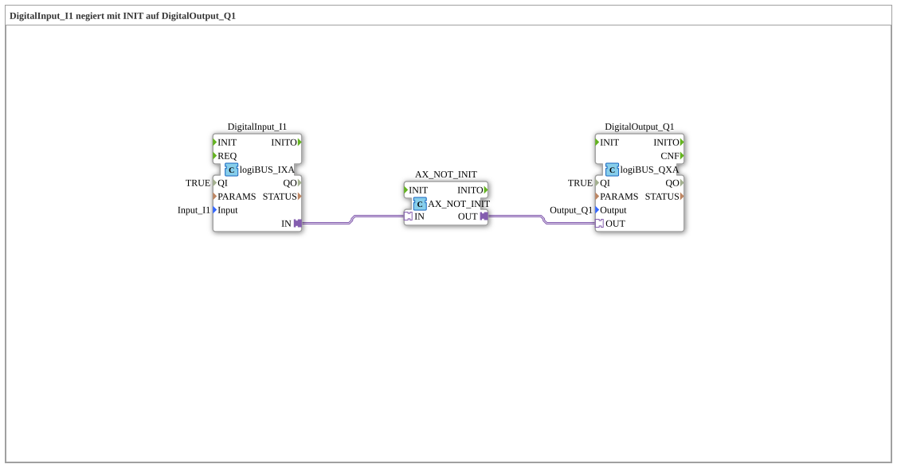

# Exercise_001f_AX: DigitalInput_I1 negated with INIT to DigitalOutput_Q1

* * * * * * * * * *
## Introduction
This exercise demonstrates the negation of a digital input signal using the function block `AX_NOT_INIT`. The negated signal is output to a digital output. A special effect occurs during startup (BOOT): Since input I1 is not polled during system startup, `AX_NOT_INIT` initially returns a value of `TRUE`, regardless of the actual input state.
## Function Blocks Used

This exercise consists of three function blocks connected within the SubApp network.

### Sub-Blocks: DigitalInput_I1
- **Type**: `logiBUS::io::DI::logiBUS_IXA`
- **Internal Function Blocks Used**: None
- **Parameters**:
- `QI` = TRUE
- `Input` = `Input_I1`
- **Event Output/Input**: None (purely data-driven via adapter)
- **Data Output/Input**: `IN` (adapter output, provides the digital input value)
- **Functionality**: The block reads the state of the digital input `Input_I1` and makes it available via the adapter output `IN`.

### Sub-Blocks: DigitalOutput_Q1
- **Type**: `logiBUS::io::DQ::logiBUS_QXA`
- **Internal Function Blocks Used**: None
- **Parameters**:
- `QI` = TRUE
- `Output` = `Output_Q1`
- **Event Output/Input**: None
- **Data Output/Input**: `OUT` (Adapter input, receives the output value to be set)
- **Functionality**: This block sets the digital output `Output_Q1` to the value present at the adapter input `OUT`.

### Sub-Blocks: AX_NOT_INIT
- **Type**: `adapter::booleanOperators::AX_NOT_INIT`
- **Internal Function Blocks Used**: None
- **Parameters**: None
- **Event Output/Input**: None
- **Data Output/Input**:
- `IN` (Adapter input, value to be negated)
- `OUT` (Adapter output, negated value)
- **Functionality**: This block negates the Boolean value at input `IN`. At system startup (BOOT), output `OUT` is set to `TRUE`, even if the input has not yet been read. This behavior is indicated by the name suffix `_INIT`.

## Program Flow and Connections

The connections in the SubApp network are implemented as adapter connections:

1. The adapter output `IN` of `DigitalInput_I1` is connected to the adapter input `IN` of `AX_NOT_INIT`.

2. The adapter output `OUT` of `AX_NOT_INIT` is connected to the adapter input `OUT` of `DigitalOutput_Q1`.

**Process**:

- The digital input value is continuously updated and passed on to `AX_NOT_INIT`.
- `AX_NOT_INIT` negates the value and passes the result to `DigitalOutput_Q1`.
- The output block sets the physical output accordingly.

**Special Note During Startup**: During the initialization phase (BOOT), `AX_NOT_INIT` has not yet received a valid input value. Therefore, it outputs its predefined startup value, `TRUE`. This causes the output to briefly become `TRUE`, even though the input is actually `FALSE`.

**Learning Objectives**:

- Understanding the negation of Boolean signals in 4diac.
- Familiarizing oneself with the startup behavior of initialized function blocks (`INIT` blocks).
- Handling adapter connections between individual function blocks.

**Difficulty Level**: Easy – suitable for beginners who want to understand basic signal processing and the behavior of function blocks in 4diac.

## Summary

Exercise `Uebung_001f_AX` illustrates the negation of a digital input signal using the special function block `AX_NOT_INIT`. The unique aspect lies in the initial output state at system startup, which is independent of the input `TRUE`. The exercise is supplemented with the comment: *“although I1 is not queried at BOOT, AX_NOT will output TRUE here.”* This emphasizes the learning effect regarding the startup behavior of initialized function blocks.

### 🌐 Related topic subpages on ms-muc-docs.de
* [🌐 Eclipse 4diac IDE & Color Reference on ms-muc-docs.de](https://www.ms-muc-docs.de/iec-61499/eclipse-4diac/)

]
