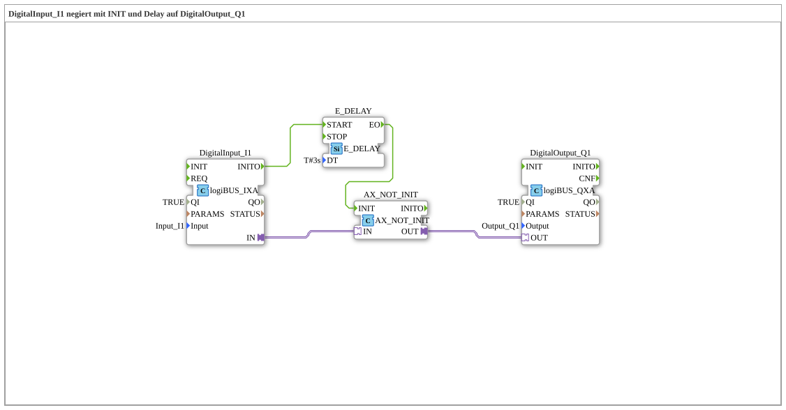

# Exercise_001g_AX: DigitalInput_I1 negated with INIT and Delay to DigitalOutput_Q1

* * * * * * * * * *
## Introduction

This exercise demonstrates the processing of a digital input signal (I1) using negation and a time delay. After an initial event and a defined delay, the input value is negated and output to a digital output (Q1). Particular emphasis is placed on the behavior of the negation block, which returns a valid value (TRUE) even if the input has not yet been queried at system startup.
## Function Blocks (FBs) Used

### Sub-Block: `DigitalInput_I1`

- **Type**: `logiBUS::io::DI::logiBUS_IXA`
- **Internal FBs Used**: None
- **Parameters**:
- `QI` = `TRUE`
- `Input` = `Input_I1`
- **Event Output**: `INITO` (triggered upon completion of initialization)
- **Data Output**: `IN` (provides the current digital input value)

### Sub-Block: `AX_NOT_INIT`

- **Type**: `adapter::booleanOperators::AX_NOT_INIT`
- **Internal Function Blocks Used**: None
- **Event Input**: `INIT` (triggers the calculation)
- **Adapter Input**: `IN` (expects a Boolean value via an adapter)
- **Adapter Output**: `OUT` (returns the negated value of the input)

### Sub-Block: `E_DELAY`

- **Type**: `iec61499::events::E_DELAY`
- **Internal Function Blocks Used**: None
- **Parameters**:
- `DT` = `T#3s` (delay time of 3 seconds)
- **Event Input**: `START` (starts the timer)
- **Event output**: `EO` (triggers after the delay time has elapsed)

### Sub-block: `DigitalOutput_Q1`

- **Type**: `logiBUS::io::DQ::logiBUS_QXA`
- **Internal function blocks used**: None
- **Parameters**:
- `QI` = `TRUE`
- `Output` = `Output_Q1`
- **Adapter input**: `OUT` (awaits the digital value to be set)

## Program flow and connections

The flow is event-driven and follows this sequence:

1. **Initialization**: The function block `DigitalInput_I1` performs its initialization at system startup. After successful initialization, the event `INITO` is triggered.
2. **Start Delay**: The event `INITO` is forwarded via an **event connection** to the input `START` of the function block `E_DELAY`. This starts a timer with a delay of 3 seconds (`DT = T#3s`).
3. **Trigger Negation**: After 3 seconds, `E_DELAY` sends the event `EO` to the input `INIT` of the function block `AX_NOT_INIT`. This calculates the negation of the currently applied input value.
4. **Value Transfer**: The current digital input value of `DigitalInput_I1` is transferred via an **adapter connection** (`IN`) to the function block `AX_NOT_INIT`. Its output `OUT` provides the negated value (`NOT`).
5. **Output**: The negated value is passed via another **adapter connection** to the input `OUT` of the function block `DigitalOutput_Q1` and thus written to the output `Output_Q1`.

**Note from the comment**: Since the input `I1` is not queried immediately during the boot process, the function block `AX_NOT_INIT` outputs the value `TRUE` in the meantime, until the first valid input value has been processed.

**Learning Objectives and Prerequisites**:

- **Difficulty Level**: Beginner
- **Prerequisites**: Basic understanding of the 4diac IDE, event and data connections.
- **Learning Objectives**:
- Working with digital inputs and outputs.
- Use of delay blocks (`E_DELAY`).
- Application of negation blocks with initialization control (`AX_NOT_INIT`).
- Understanding of initialization behavior and event chaining.

**Starting the exercise**: Import the SubApp into a 4diac project, assign the inputs and outputs to the corresponding hardware or simulation resources, and execute the configuration.

## Summary

Exercise `Uebung_001g_AX` demonstrates how to negate a digital input signal after a defined delay of 3 seconds and output it to a digital output. The input initialization event is used to start the timer, and the special negation block `AX_NOT_INIT` ensures that a defined output state (`TRUE`) is output even if no initial input value is present. This is a basic example of event-driven signal processing in 4diac.

---

### 🌐 Related topic subpages on ms-muc-docs.de

- [🌐 Eclipse 4diac IDE & color reference on ms-muc-docs.de ](https://www.ms-muc-docs.de/iec-61499/eclipse-4diac/)

]
