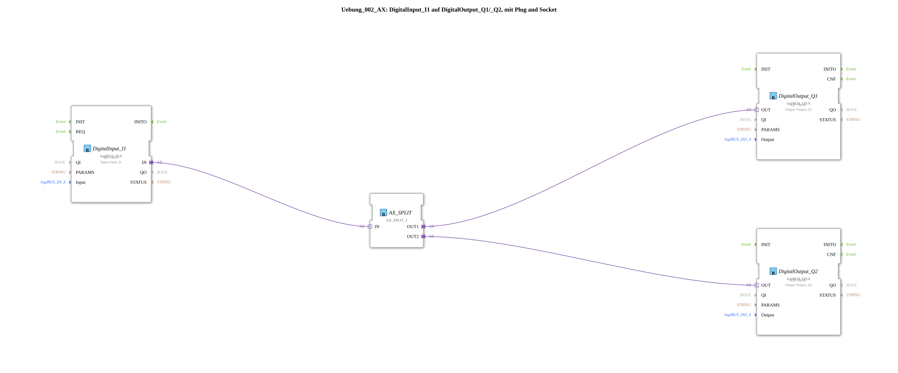

# Exercise_002_AX: DigitalInput_I1 to DigitalOutput_Q1/_Q2, using Plug and Socket

This article describes the logiBUS® exercise `Uebung_002_AX`, in which a single digital input signal is distributed to two different digital outputs. This exercise utilizes the concept of adapter branching.
----
## Objective of the Exercise

The main objective of this exercise is to demonstrate how adapter connections can be branched according to IEC 61499. Since a "plug" (output of an adapter) in 4diac can often only be connected to one "socket" (input of an adapter) (depending on the version and configuration), a special splitter module is used to cleanly distribute a signal to multiple receivers.

-----

## Description and Components

[cite_start]In the subapplication `Uebung_002_AX.SUB`, a digital input is read and passed on to two digital outputs via an adapter splitter[cite: 1].

### Function Blocks (FBs)

The following function blocks are used:

* **`DigitalInput_I1`**: An instance of type `logiBUS_IXA`. [cite_start]This function block reads the hardware input `Input_I1`[cite: 1].
* **`AX_SPLIT`**: An instance of type `AX_SPLIT_2`. This component has one adapter input (`IN`) and two identical adapter outputs (`OUT1`, `OUT2`) and thus functions as a signal multiplier.
* **`DigitalOutput_Q1`** & **`DigitalOutput_Q2`**: Instances of type `logiBUS_QXA`. These represent the physical outputs `Output_Q1` and `Output_Q2`.

### Adapter Interface: `AX.adp`

[cite_start]This exercise also uses the unidirectional adapter type `AX`, which bundles events and data values for transmission[cite: 2].

-----

## Functionality

Signal distribution is achieved through the central position of the `AX_SPLIT` module in the network. The structure in `Uebung_002_AX.SUB` is defined as follows:

<AdapterConnections>
<Connection Source="DigitalInput_I1.IN" Destination="AX_SPLIT.IN"/>
<Connection Source="AX_SPLIT.OUT1" Destination="DigitalOutput_Q1.OUT"/>
<Connection Source="AX_SPLIT.OUT2" Destination="DigitalOutput_Q2.OUT"/>
</AdapterConnections>

The signal path proceeds in the following steps:

1. The `DigitalInput_I1` module detects a change at its physical input.
2. An adapter event is sent to the `AX_SPLIT` module.
3. The `AX_SPLIT` module replicates this event and the associated data value (`D1`) directly to its two outputs, `OUT1` and `OUT2`.
4. Both output modules (`DigitalOutput_Q1` and `DigitalOutput_Q2`) receive the signal simultaneously and activate their respective hardware outputs.

As a result, both outputs switch synchronously with the state of input `I1`.

-----

## Application Example

A typical application example is the **parallel status display**:

A sensor on a machine (`I1`) should not only control the internal logic, but also simultaneously activate a local indicator light (`Q1`) and a signal lamp on a remote control panel (`Q2`). Using the splitter ensures that both displays always reflect the identical state of the sensor, without having to implement the logic separately for each output.

---

### 🌐 Related topic subpages on ms-muc-docs.de

* [🌐 Eclipse 4diac IDE & Color Reference on ms-muc-docs.de](https://www.ms-muc-docs.de/iec-61499/eclipse-4diac/)

]
