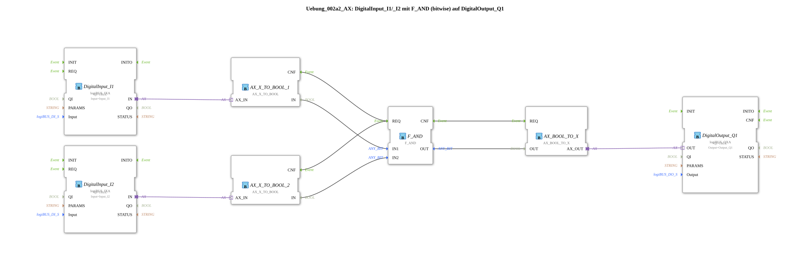

# Exercise_002a2_AX: DigitalInput_I1/_I2 with F_AND (bitwise) on DigitalOutput_Q1

This article describes the logiBUS® exercise `Uebung_002a2_AX`. It demonstrates how to convert adapter signals into Boolean values for processing with standard logic blocks.
----
## Objective of the Exercise

The main objective is to demonstrate interoperability. While specialized blocks like `AX_AND_2` operate directly on adapters, many standard libraries (such as the bitwise operators of IEC 61131) require elementary data types (BOOL). This exercise illustrates the path from hardware abstraction to classical logic and back.

-----

## Description and Components

[cite_start]The subapplication `Uebung_002a2_AX.SUB` uses conversion blocks to prepare two input adapters for an AND gate[cite: 1].

### Function Blocks (FBs)

* **`AX_X_TO_BOOL_1` & `_2`**: Convert the adapter signal (`Event + Data`) into an explicit event `CNF` and a Boolean value `IN`.
* **`F_AND`**: A classic bitwise AND gate from the IEC 61131 library.
* **`AX_BOOL_TO_X`**: Converts the logic output back into an adapter signal.
* **`DigitalInput_I1` & `I2`**: Inputs.
* **`DigitalOutput_Q1`**: Output.

-----

## Functionality

1. **Acquisition**: The adapter inputs provide a signal with each change.
2. **Conversion**: The `TO_BOOL` components extract the state.
3. **Processing**: The `F_AND` gate checks: Are both inputs `TRUE`?
4. **Conversion**: The result is repackaged into the adapter structure.
5. **Output**: The output `Q1` switches accordingly.

While this method is more complex than using `AX_AND_2`, it allows the use of any logic library.

-----

## Application Example

**State Monitoring with Standard Function Blocks**: If you want to use complex mathematical or logical functions that only exist for `BOOL` or `INT` data types, this conversion method is the standard approach.