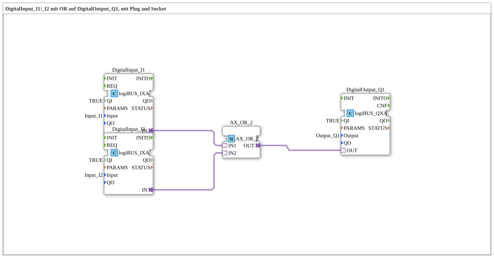

# Exercise_002a3_AX: DigitalInput_I1/_I2 with OR on DigitalOutput_Q1, using Plug and Socket

This article describes the logiBUS® exercise `Uebung_002a3_AX`. In this exercise, a logical OR gate is implemented, in which a digital output is activated as soon as at least one of two digital inputs is in the "True" (HIGH) state.
----
## Objective of the Exercise

The main objective of this exercise is to demonstrate the functionality of an OR gate in automation technology. It shows how alternative conditions (inputs) can be used to trigger the same action (output). This is a standard requirement for systems that must be operable from multiple locations.

-----

## Description and Components

[cite_start]The subapplication `Uebung_002a3_AX.SUB` combines two digital input signals using an OR logic block[cite: 1].

### Function Blocks (FBs)

The following blocks are used:

* **`DigitalInput_I1` & `DigitalInput_I2`**: Instances of type `logiBUS_IXA`. [cite_start]These blocks detect the states of the physical inputs `Input_I1` and `Input_I2`[cite: 1].
* **`AX_OR_2`**: An instance of type `AX_OR_2`. This function block performs the logical OR operation at the adapter level. It has two adapter inputs (`IN1`, `IN2`) and one adapter output (`OUT`)[cite: 1].
* **`DigitalOutput_Q1`**: An instance of type `logiBUS_QXA`. This function block sets the physical output `Output_Q1` based on the result of the OR operation[cite: 1].

### Adapter Interface: `AX.adp`

[cite_start]By using the adapter type `AX`, state changes (events) and Boolean values (data) are passed together through the logic blocks[cite: 2].

----

## Functionality

The logic is defined by the configuration of the adapter connections in the subapplication. The structure in `Uebung_002a3_AX.SUB` is as follows:

<AdapterConnections>
<Connection Source="DigitalInput_I1.IN" Destination="AX_OR_2.IN1"/>
<Connection Source="DigitalInput_I2.IN" Destination="AX_OR_2.IN2"/>
<Connection Source="AX_OR_2.OUT" Destination="DigitalOutput_Q1.OUT"/>
</AdapterConnections>

The process follows this logic:

1. The function block `AX_OR_2` monitors both adapter inputs.
2. If at least one input (`IN1` OR `IN2`) has the data value `D1 = TRUE`, the function block also sets its output `OUT` to `TRUE` and sends an event.
3. Only if both inputs are at `FALSE` does the output also go to `FALSE`.
4. The function block `DigitalOutput_Q1` updates the physical output `Q1` whenever the output of the OR block changes.

-----

## Application Example

A typical application example is **hallway lighting with two switches**:

In a long hallway, there is a switch at each end (`I1` and `I2`). The light (`Q1`) should illuminate when switch 1 is pressed OR when switch 2 is pressed. This "either-or" logic (or "at least one" logic) is perfectly implemented by the `AX_OR_2` function block, allowing the lighting to be switched on independently from either location.
