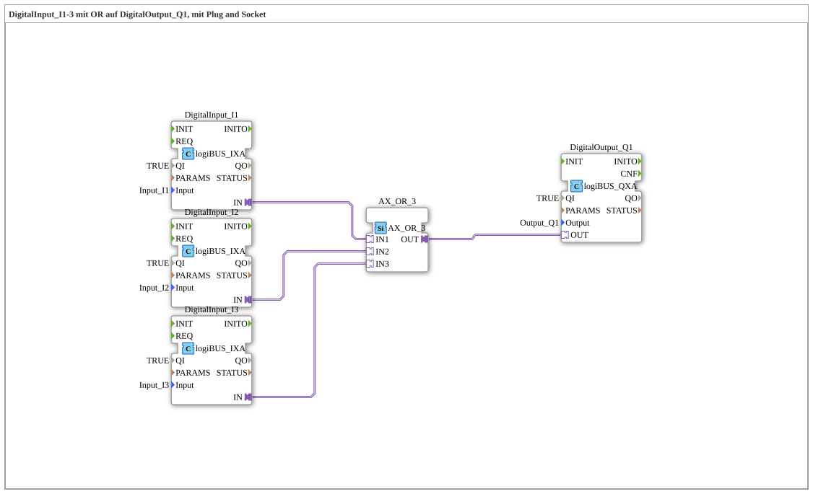

# Exercise_002a5_AX: DigitalInput_I1-3 with OR on DigitalOutput_Q1, with Plug and Socket

[](https://notebooklm.google.com/notebook/041f4df4-b729-484d-b786-b6dcdf151961)

This article describes the logiBUS® exercise `Uebung_002a5_AX`. In this exercise, a logical OR gate with three inputs is implemented. The digital output is activated as soon as at least one of the three monitored inputs carries a signal.

----

## Objective of the Exercise

The main objective of this exercise is to extend the basic logic functions to more than two input signals. It illustrates the scalability of logic blocks in IEC 61499 and shows how multiple alternative switching conditions can be efficiently combined in a controller.


``` -----

## Description and Components

[cite_start]The subapplication `Uebung_002a5_AX.SUB` implements a 3-way OR logic using adapter connections[cite: 1].

### Function Blocks (FBs)

The following blocks are used in this configuration:



* **`DigitalInput_I1`, `I2`, `I3`**: Three instances of type `logiBUS_IXA`. [cite_start]These capture the states of the hardware inputs `Input_I1` to `Input_I3`[cite: 1].

* **`AX_OR_3`**: An instance of type `AX_OR_3`. [cite_start]This function block performs an OR operation on three adapter inputs (`IN1`, `IN2`, `IN3`) and outputs the result to the adapter output `OUT`[cite: 1].

* **`DigitalOutput_Q1`**: An instance of type `logiBUS_QXA`. [cite_start]This function block controls the hardware output `Output_Q1`[cite: 1].


### Adapter Interface: `AX.adp`

[cite_start]As with the previous exercises, the adapter type `AX` is used for the seamless transfer of events and data[cite: 2].

-----

## Functionality

The logic is implemented by connecting the three inputs to the logic block in the sub-application. The structure in `Uebung_002a5_AX.SUB` is defined as follows:


```xml
<AdapterConnections>
    <Connection Source="DigitalInput_I1.IN" Destination="AX_OR_3.IN1"/>
    <Connection Source="DigitalInput_I2.IN" Destination="AX_OR_3.IN2"/>
    <Connection Source="DigitalInput_I3.IN" Destination="AX_OR_3.IN3"/>
    <Connection Source="AX_OR_3.OUT" Destination="DigitalOutput_Q1.OUT"/>
</AdapterConnections>
```


Functional Flow:

1. The function block `AX_OR_3` continuously monitors all three adapter inputs for state changes.

2. If at least one input is in state `TRUE`, the output `OUT` switches to `TRUE`.

3. Only if all three inputs (`I1`, `I2`, and `I3`) are in state `FALSE`, is the output deactivated.

4. The output block `DigitalOutput_Q1` follows the logical result of the OR block in real time.


``` -----

## Application Example

A typical application example is a **collective fault message**:

Three different sensors on a machine (e.g., overtemperature `I1`, low oil `I2`, and emergency stop `I3`) should activate a common warning light (`Q1`) or a horn. As soon as even one of the sensors reports a fault, the operator is warned via the common output. This reduces wiring effort and consolidates important status information.