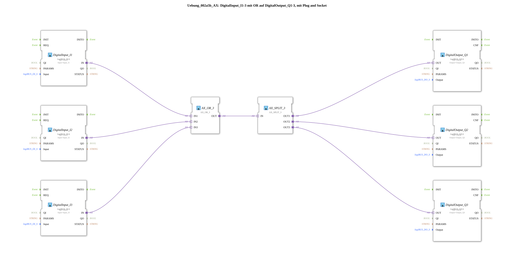

# Exercise_002a5b_AX: DigitalInput_I1-3 with OR to DigitalOutput_Q1-3, using Plug and Socket

* * * * * * * * * *
This exercise demonstrates the basic interconnection of multiple digital inputs with multiple digital outputs. A logical OR operation is used to combine the states of the inputs. The result of this operation is then distributed to various digital outputs via a signal distributor. The implementation utilizes the concept of adapter function blocks to realize the Boolean logic and signal distribution.
Exercise `Uebung_002a5b_AX` uses a combination of specific I/O blocks and generic logic and signal distribution blocks.

## Function Blocks Used (FBs)
## Introduction
### Sub-Blocks: logiBUS_IXA
- **Type**: `logiBUS::io::DI::logiBUS_IXA` (represented by instances such as `DigitalInput_I1`, `DigitalInput_I2`, `DigitalInput_I3`)
- **Internal Function Blocks Used**: No internal function blocks are visible in the provided definition.
- **Block Name**: DigitalInput_I1 (Example instance)
- Parameter: QI = TRUE
- Parameter: Input = Input_I1
- Event Output/Input: Used internally for processing the input status; typically sends a data event when the value changes.
- Data Output/Input: IN (Data output that provides the logical state of the digital input)
- **Functionality**: This function block is used to read the logical state of a specific digital input. It monitors the assigned physical input (e.g., `Input_I1`) and provides its current status as a Boolean value at its data output `IN`.

### Sub-Blocks: logiBUS_QXA
- **Type**: `logiBUS::io::DQ::logiBUS_QXA` (represented by instances such as `DigitalOutput_Q1`, `DigitalOutput_Q2`, `DigitalOutput_Q3`)
- **Internal Function Blocks Used**: No internal function blocks are visible in the provided definition.
- **Block Name**: DigitalOutput_Q1 (Example Instance)
- Parameter: QI = TRUE
- Parameter: Output = Output_Q1
- Event Output/Input: Used internally for processing the output status; Typically receives a data event to update the output.
- Data output/input: OUT (Data input that receives the logical state to set the digital output)
- **Functionality**: This function block is used to control a specific digital output. It sets the state of the assigned physical output (e.g., `Output_Q1`) based on the Boolean value present at its data input `OUT`.

### Sub-blocks: AX_OR_3
- **Type**: `adapter::booleanOperators::AX_OR_3` (represented by the instance `AX_OR_3`)
- **Internal FBs Used**: No internal FBs are visible in the provided definition.
- **Block Name**: AX_OR_3
- Parameters: No specific parameters for this instance are present in the definition.
- Event output/input: Transmits events synchronously with the data (Plug and Socket Adapter).
- Data output/input: IN1, IN2, IN3 (data inputs), OUT (data output)
- **Functionality**: This function block implements a three-input logical OR gate. The data output `OUT` becomes `TRUE` if at least one of the three data inputs (`IN1`, `IN2`, `IN3`) has the value `TRUE`. Otherwise, the output is `FALSE`.

### Sub-Blocks: AX_SPLIT_3
- **Type**: `adapter::events::unidirectional::AX_SPLIT_3` (represented by the instance `AX_SPLIT_3`)
- **Internal Function Blocks Used**: No internal function blocks are visible in the provided definition.
- **Block Name**: AX_SPLIT_3
- Parameters: No specific parameters for this instance are present in the definition.
- Event Output/Input: Transmits events synchronously with the data (Plug and Socket Adapter).
- Data Output/Input: IN (Data Input), OUT1, OUT2, OUT3 (Data Outputs)
- **Functionality**: This block serves as a signal distributor. It receives a single input signal at data input `IN` and simultaneously forwards it identically to three separate data outputs (`OUT1`, `OUT2`, `OUT3`).

The exercise `Uebung_002a5b_AX` implements a control logic in which the states of three digital inputs are evaluated using an OR gate, and the result is distributed to three digital outputs.

1. **Input Acquisition**: The function blocks `DigitalInput_I1`, `DigitalInput_I2`, and `DigitalInput_I3` continuously read the states of the physical inputs `Input_I1`, `Input_I2`, and `Input_I3`, respectively. Their respective data outputs (`DigitalInput_I1.IN`, `DigitalInput_I2.IN`, `DigitalInput_I3.IN`) provide these states.

`` 2. **Logical OR operation**: The data outputs of the three input blocks are directly connected to the data inputs of the OR block `AX_OR_3`:

* `DigitalInput_I1.IN` is connected to `AX_OR_3.IN1`.
* `DigitalInput_I2.IN` is connected to `AX_OR_3.IN2`.
* `DigitalInput_I3.IN` is connected to `AX_OR_3.IN3`.

The `AX_OR_3` block logically combines these three Boolean values. The result (`TRUE`, if I1 OR I2 OR I3 is `TRUE`) is made available at its data output `AX_OR_3.OUT`.

3. **Signal Distribution**: The data output of the OR gate (`AX_OR_3.OUT`) is connected to the data input of the signal distributor `AX_SPLIT_3` (`AX_SPLIT_3.IN`). The `AX_SPLIT_3` gate duplicates this single control signal and forwards it to its three data outputs (`AX_SPLIT_3.OUT1`, `AX_SPLIT_3.OUT2`, `AX_SPLIT_3.OUT3`).

4. **Output Control**: The outputs of the signal distributor are each connected to the inputs of the digital output modules:

* `AX_SPLIT_3.OUT1` is connected to `DigitalOutput_Q1.OUT`.
* `AX_SPLIT_3.OUT2` is connected to `DigitalOutput_Q2.OUT`.
* `AX_SPLIT_3.OUT3` is connected to `DigitalOutput_Q3.OUT`.

This means that all three digital outputs `Output_Q1`, `Output_Q2`, and `Output_Q3`Assume the same state that corresponds to the result of the OR operation of the three inputs.

**Learning Objectives**:

* Understanding and application of digital input and output components.
* Implementation of basic logic operations (OR) in the 4diac IDE.
* Use of signal splitters to efficiently control multiple components from a single control signal.
* Familiarization with the concept of adapter components for flexible connections.

**Difficulty Level**: Intermediate. Basic knowledge of digital logic and operation of the 4diac IDE is advantageous.

**Required Prior Knowledge**: Familiarity with the fundamentals of automation technology and application development in the 4diac IDE.

**Starting the Exercise**: Load the application `Uebung_002a5b_AX` onto a 4diac-compatible controller (PLC or runtime environment). Observe the behavior of outputs Q1, Q2, and Q3 when you manually switch digital inputs I1, I2, or I3.

``## Summary
The exercise `Uebung_002a5b_AX` provides a practical introduction to combining digital I/O signals. It demonstrates how to combine multiple inputs into a single control signal using a logical OR operation. This signal is then split to enable synchronized control of multiple outputs. The core principle is that all three outputs (Q1, Q2, Q3) become active as soon as at least one of the three inputs (I1, I2, I3) is active. This type of group control is a fundamental function in many automation applications.

---

* [🌐 Eclipse 4diac IDE & color reference on ms-muc-docs.de](https://www.ms-muc-docs.de/iec-61499/eclipse-4diac/)

## Program Flow and Connections
## Summary
### 🌐 Passende Themen-Unterseiten auf ms-muc-docs.de