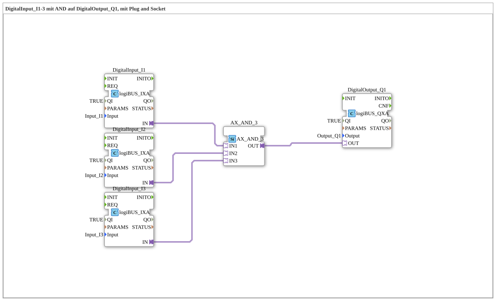

# Exercise_002a6_AX: DigitalInput_I1-3 with AND on DigitalOutput_Q1, using Plug and Socket

[(https://notebooklm.google.com/notebook/041f4df4-b729-484d-b786-b6dcdf151961)
This article describes the logiBUS® exercise `Uebung_002a6_AX`. In this exercise, a logical AND gate with three inputs is implemented. The digital output is only activated if all three monitored inputs are simultaneously in the "True" (HIGH) state
----

## Objective of the Exercise

The main objective of this exercise is to implement more complex conditional logic. It demonstrates how multiple safety or operational parameters can be combined to enable an actuator. This is a typical requirement in industrial control engineering to ensure that several conditions are met before an action is executed.

-----

## Description and Components

[cite_start]The subapplication `Uebung_002a6_AX.SUB` uses a triple AND gate to combine three digital inputs with one output[cite: 1].

### Function Blocks (FBs)

The following blocks are used:

- **`DigitalInput_I1`, `I2`, `I3`**: Three instances of type `logiBUS_IXA`. [cite_start]These capture the states of the physical inputs `Input_I1` to `Input_I3`[cite: 1].
- **`AX_AND_3`**: An instance of type `AX_AND_3`. [cite_start]This function block performs the logical AND operation on three adapter inputs (`IN1`, `IN2`, `IN3`) and provides the result at the adapter output `OUT`[cite: 1].
- **`DigitalOutput_Q1`**: An instance of type `logiBUS_QXA`. [cite_start]This function block controls the hardware output `Output_Q1`[cite: 1].

### Adapter Interface: `AX.adp`

[cite_start]As in the previous exercises, the adapter type `AX` is used to route events and data values encapsulated within the logic.[cite: 2]

-----

## Functionality

The logic is implemented by connecting the three input blocks with the AND logic block in the subapplication. The structure in `Uebung_002a6_AX.SUB` is defined as follows:

<AdapterConnections>
<Connection Source="DigitalInput_I1.IN" Destination="AX_AND_3.IN1"/>
<Connection Source="DigitalInput_I2.IN" Destination="AX_AND_3.IN2"/>
<Connection Source="DigitalInput_I3.IN" Destination="AX_AND_3.IN3"/>
<Connection Source="AX_AND_3.OUT" Destination="DigitalOutput_Q1.OUT"/>
</AdapterConnections>

Functional Flow:

1. The function block `AX_AND_3` monitors all three adapter inputs for state changes.
2. Only if all three inputs (`I1` AND `I2` AND `I3`) simultaneously carry the data value `D1 = TRUE`, is the output `OUT` also set to `TRUE`.
3. As soon as even one of the three inputs reaches `FALSE`, the output is immediately deactivated.
4. The function block `DigitalOutput_Q1` switches the physical output `Q1` according to the logical result.

-----

## Application Example

A typical application example is **machine enable with multiple safety conditions**:

For a machine (`Q1`) to start, three conditions must be met: The safety door must be closed (`I1`), the emergency stop must be unlocked (`I2`), and the operator must press the start button (`I3`). Only when all three signals are "true" simultaneously does the controller enable operation. This ensures maximum safety for both people and machines.
