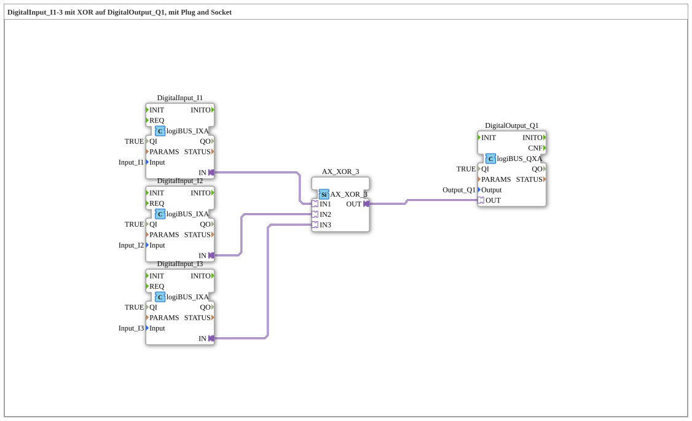

# Exercise_002a7_AX: DigitalInput_I1-3 with XOR to DigitalOutput_Q1, using Plug and Socket

[](https://notebooklm.google.com/notebook/041f4df4-b729-484d-b786-b6dcdf151961)

This article describes the logiBUS® exercise `Uebung_002a7_AX`. In this exercise, an exclusive OR (XOR) operation with three inputs is implemented. The output is activated when an odd number of inputs are active.

----

## Objective of the Exercise



The main objective of this exercise is to demonstrate XOR logic with more than two inputs. Unlike a standard OR operation, where the output is activated when *at least* one input is active, XOR logic responds to the parity of the input signals. This is often used for toggle switching or parity checks.

-----

## Description and Components

[cite_start]The subapplication `Uebung_002a7_AX.SUB` uses a 3-way XOR gate to combine three digital inputs with one output[cite: 1].

### Function Blocks (FBs)

The following blocks are used:

* **`DigitalInput_I1`, `I2`, `I3`**: Three instances of type `logiBUS_IXA`. [cite_start]These capture the hardware inputs `Input_I1` to `Input_I3`[cite: 1].

* **`AX_XOR_3`**: An instance of type `AX_XOR_3`. [cite_start]This block performs the exclusive OR operation on three adapter inputs (`IN1`, `IN2`, `IN3`) and outputs the result to the adapter output `OUT`[cite: 1].

* **`DigitalOutput_Q1`**: An instance of type `logiBUS_QXA`. [cite_start]This block controls the hardware output `Output_Q1`[cite: 1].


### Adapter Interface: `AX.adp`

[cite_start]The adapter type `AX` also bundles events and data values for efficient logic processing [cite: 2].

-----

## Functionality

The logic is defined by connecting the input blocks with the XOR logic block in the subapplication. The structure in `Uebung_002a7_AX.SUB` is as follows:


```xml
<AdapterConnections>
    <Connection Source="DigitalInput_I1.IN" Destination="AX_XOR_3.IN1"/>
    <Connection Source="DigitalInput_I2.IN" Destination="AX_XOR_3.IN2"/>
    <Connection Source="DigitalInput_I3.IN" Destination="AX_XOR_3.IN3"/>
    <Connection Source="AX_XOR_3.OUT" Destination="DigitalOutput_Q1.OUT"/>
</AdapterConnections>
```
[cite_start][cite: 1]

The three-input XOR logic behaves as follows:

* The output is **TRUE** if exactly **one** input is active.

* The output is **TRUE** if all **three** inputs are active.

* The output is **FALSE** if no input or exactly two inputs are active.

This corresponds to the mathematical definition of the XOR operation as odd parity.

----

## Application Example

A classic application example is a **three-way switch**:

In a room with three doors, there is a switch at each door (`I1`, `I2`, `I3`). The light (`Q1`) should be able to be switched on and off from any door, regardless of the state of the other switches. Each actuation of any switch changes the state of the light (from on to off or vice versa). This is perfectly achieved through the parity logic of the XOR operation.