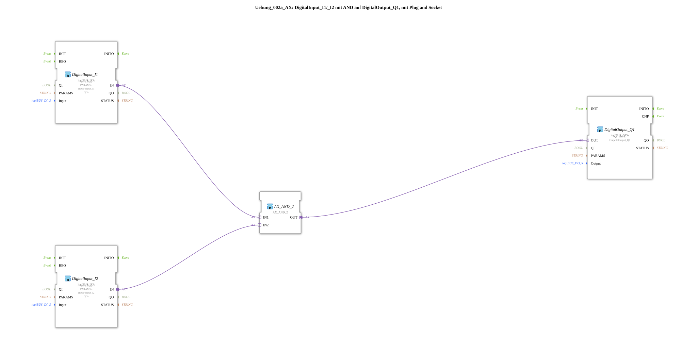

# Exercise_002a_AX: DigitalInput_I1/_I2 with AND on DigitalOutput_Q1, using Plug and Socket

[(https://notebooklm.google.com/notebook/041f4df4-b729-484d-b786-b6dcdf151961)
This article describes the logiBUS® exercise `Uebung_002a_AX`. In this exercise, a classic AND gate is implemented, where a digital output is only activated if two digital inputs are simultaneously in the "True" (HIGH) state.
-----
## Objective of the Exercise

The main objective of this exercise is to implement a basic logical decision structure. It demonstrates how signals from multiple sensors (inputs) can be combined to trigger an action at an actuator (output). This is a fundamental building block of any control programming.

-----

## Description and Components

[cite_start]The subapplication `Uebung_002a_AX.SUB` links two digital inputs to a digital output via a logic block[cite: 1].

### Function Blocks (FBs)

The following blocks are used:

* **`DigitalInput_I1` & `DigitalInput_I2`**: Instances of type `logiBUS_IXA`. [cite_start]These represent the two hardware inputs that are monitored[cite: 1].
* **`AX_AND_2`**: An instance of type `AX_AND_2`. [cite_start]This block performs the logical AND operation directly on the adapter interfaces. It has two adapter inputs (`IN1`, `IN2`) and one adapter output (`OUT`)[cite: 1].
* **`DigitalOutput_Q1`**: An instance of type `logiBUS_QXA`. [cite_start]This component controls the hardware output `Output_Q1` based on the result of the logic[cite: 1].

### Adapter interface: `AX.adp`

[cite_start]All signal processing is handled by the adapter type `AX`, which efficiently routes events and data values through the network[cite: 2].

-----

## Functionality

The logic is determined by the wiring of the adapter connections in the sub-application. The structure in `Uebung_002a_AX.SUB` is defined as follows:

<AdapterConnections>
<Connection Source="DigitalInput_I1.IN" Destination="AX_AND_2.IN1"/>
<Connection Source="DigitalInput_I2.IN" Destination="AX_AND_2.IN2"/>
<Connection Source="AX_AND_2.OUT" Destination="DigitalOutput_Q1.OUT"/>
</AdapterConnections>

The process follows this logic:

1. The function block `AX_AND_2` monitors both adapter inputs.
2. Only if both inputs (`IN1` AND `IN2`) have the data value `D1 = TRUE`, does the function block also set its output `OUT` to `TRUE` and send an event.
3. As soon as one of the inputs goes to `FALSE`, the output is also immediately set to `FALSE`.
4. The function block `DigitalOutput_Q1` reacts immediately to the state changes at the output of the logic block.

-----

## Application Example

A classic application example is **two-hand operation for safety**:

To start a dangerous machine (e.g., a press), the operator must simultaneously press two spatially separated pushbuttons (`I1` and `I2`). This ensures that both of the operator's hands are outside the danger zone. Only when both pushbuttons are active does the `AX_AND_2` module release the signal to the output `Q1` (the press motor).
