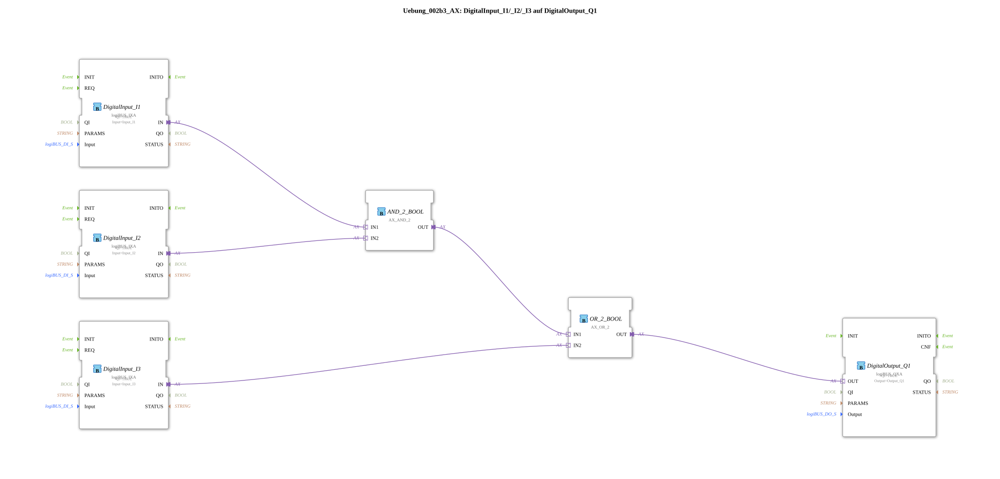

# Exercise_002b3_AX: DigitalInput_I1/_I2/_I3 to DigitalOutput_Q1

[(https://notebooklm.google.com/notebook/041f4df4-b729-484d-b786-b6dcdf151961)
This article describes the logiBUS® exercise `Uebung_002b3_AX`. In this exercise, a combinational logic circuit is implemented that links two basic operations (AND and OR) to fulfill a more complex switching condition.
----
## Objective of the Exercise

The main objective of this exercise is the hierarchical linking of logic blocks. It demonstrates how partial results of a logical operation (here, an AND) can serve as input for another operation (here, an OR). This enables the representation of arbitrarily complex logical expressions in control engineering.

-----

## Description and Components

[cite_start]The subapplication `Uebung_002b3_AX.SUB` implements the logical function `Q1 = (I1 AND I2) OR I3` using adapter logic blocks[cite: 1].

### Function Blocks (FBs)

The following components are instantiated in the subapplication:

- **`DigitalInput_I1`, `I2`, `I3`**: Instances of type `logiBUS_IXA`. [cite_start]They provide the input signals for the logic chain[cite: 1].
- **`AND_2_BOOL`**: An instance of type `AX_AND_2`. [cite_start]Combines the inputs `I1` and `I2`[cite: 1].
- **`OR_2_BOOL`**: An instance of type `AX_OR_2`. [cite_start]Combines the result of the AND gate with the third input `I3`[cite: 1].
- **`DigitalOutput_Q1`**: An instance of type `logiBUS_QXA`. [cite_start]Outputs the final result of the combinational logic to the hardware output[cite: 1].

### Adapter Interface: `AX.adp`

[cite_start]By consistently using adapter blocks, explicit event data converters (such as `F_MOVE`) are unnecessary, as the `AX` blocks handle both internally[cite: 1].

-----

## Functionality

The hierarchical structure of the logic is clearly illustrated by the interconnection of the adapter connections in the subapplication `Uebung_002b3_AX.SUB`:

<AdapterConnections>
<Connection Source="DigitalInput_I1.IN" Destination="AND_2_BOOL.IN1"/>
<Connection Source="DigitalInput_I2.IN" Destination="AND_2_BOOL.IN2"/>
<Connection Source="AND_2_BOOL.OUT" Destination="OR_2_BOOL.IN1"/>
<Connection Source="DigitalInput_I3.IN" Destination="OR_2_BOOL.IN2"/>
<Connection Source="OR_2_BOOL.OUT" Destination="DigitalOutput_Q1.OUT"/>
</AdapterConnections>

Functional Process:

1. The system first calculates the partial result of the AND operation between `I1` and `I2`.
2. This partial result is passed to the first input of the OR block.
3. The OR block compares this partial result with the direct signal from `I3`.
4. The output `Q1` is activated if either both first inputs (`I1` AND `I2`) are active OR if the third input (`I3`) is active.

-----

## Application Example

A typical application example is **system enable with bypass**:

A motor (`Q1`) should normally only run when two sensors (`I1` and `I2`) simultaneously give a green light (e.g., oil pressure reached AND temperature OK). However, for maintenance purposes or in emergency operation, the motor should also be able to be started when a special key switch (`I3`) is activated, which bypasses the normal logic. This requirement is precisely met by the logic of `(I1 AND I2) OR I3`.
