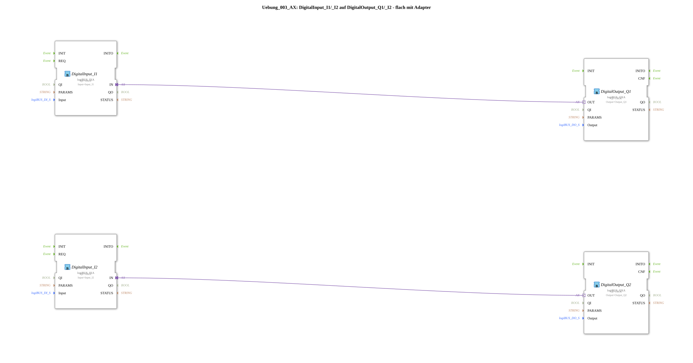

# Exercise_003_AX: DigitalInput_I1/_I2 to DigitalOutput_Q1/_I2 - Flat with Adapter

This article describes the logiBUS® exercise `Uebung_003_AX`. In this exercise, two independent signal paths are implemented, where each digital input directly controls an associated digital output.
----
## Objective of the Exercise

The main objective of this exercise is to demonstrate the parallel processing of signals in IEC 61499. Unlike sequential programming models (such as classic PLC cycles in STL), the function blocks in 4diac operate event-driven and independently of each other. This makes it possible to implement multiple control tasks simultaneously and without mutual interference in a single sub-application.

-----

## Description and Components

[cite_start]The subapplication `Uebung_003_AX.SUB` defines two separate "strands" of signal processing that exist in parallel[cite: 1].

### Function Blocks (FBs)

Two pairs of input and output blocks are used:

* **`DigitalInput_I1` & `DigitalOutput_Q1`**: The first pair (channel 1). [cite_start]Connects hardware input `I1` to hardware output `Q1`[cite: 1].
* **`DigitalInput_I2` & `DigitalOutput_Q2`**: The second pair (channel 2). Connects hardware input `I2` to hardware output `Q2`[cite: 1].

### Adapter Interface: `AX.adp`

Both connections use the standardized adapter interface `AX` for communication[cite: 1].

-----

## Functionality

The independence of the two channels is ensured by the separate adapter connections in the sub-application `Uebung_003_AX.SUB`:

<AdapterConnections>
<Connection Source="DigitalInput_I1.IN" Destination="DigitalOutput_Q1.OUT"/>
<Connection Source="DigitalInput_I2.IN" Destination="DigitalOutput_Q2.OUT"/>
</AdapterConnections>

The functional sequence:

1. If the state of `I1` changes, `DigitalInput_I1` sends an event directly to `DigitalOutput_Q1`. The output `Q1` is then activated.
2. If the state of `I2` changes, `DigitalInput_I2` sends an event directly to `DigitalOutput_Q2`. The output `Q2` is then activated.

These two processes run completely asynchronously. A high switching frequency on channel 1 has no effect on the response time or function of channel 2.

-----

## Application Example

A simple application example is the **control of two independent pumps**:

In a pumping station, there are two identical pumps, each operated by its own local switch. Switch 1 (`I1`) starts pump 1 (`Q1`), and switch 2 (`I2`) starts pump 2 (`Q2`). Although both controls run in the same control program, they operate completely independently. If one sensor fails, the other circuit remains fully functional.

---

### 🌐 Related topic subpages on ms-muc-docs.de

* [🌐 Eclipse 4diac IDE & Color Reference on ms-muc-docs.de](https://www.ms-muc-docs.de/iec-61499/eclipse-4diac/)

]
