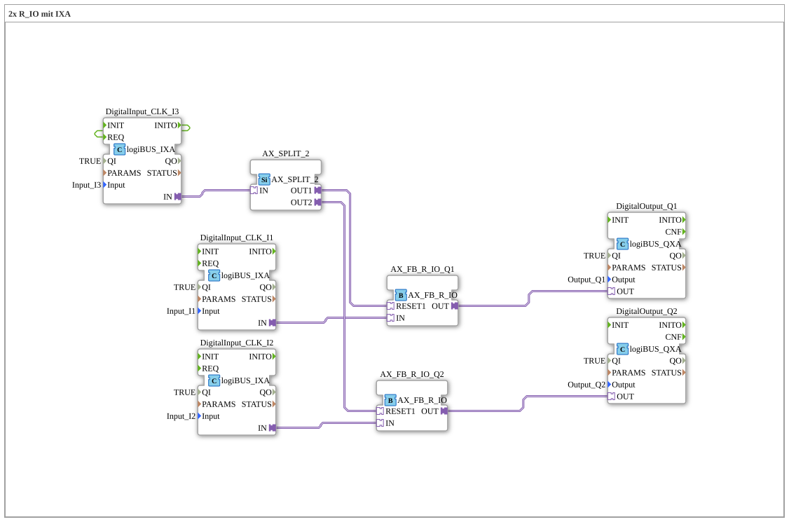

# Exercise_003a2b_AX: 2x R_IO with IXA

* * * * * * * * * *
## Introduction

This exercise demonstrates the control of two digital outputs (Q1 and Q2) using a reset-set function block (AX_FB_R_IO) for each output. The reset inputs of both blocks are controlled jointly via a third digital input (I3), which acts as a "maintenance off" switch. An AX_SPLIT_2 distributes the reset signal to both channels.
The goal is to understand the interaction of monostable elements (R_IO) with hardware inputs and outputs, as well as the implementation of a common reset function.

## Function Blocks (FBs) Used

### Sub-Blocks: logiBUS-IXA (Digital Inputs)

- **Type**: `logiBUS::io::DI::logiBUS_IXA`
- **Used as**:
- `DigitalInput_CLK_I1` – Input I1 (Set for Q1)
- `DigitalInput_CLK_I2` – Input I2 (Set for Q2)
- `DigitalInput_CLK_I3` – Input I3 (Common Reset)
- **Parameters**:
- `QI` = `TRUE` (Enabled)
- `Input` = `Input_I1`, `Input_I2`, `Input_I3` (Hardware channels)
- `PARAMS` = empty (not visible)
- **Functionality**: Converts a physical digital signal (e.g., button or switch) into a logic adapter signal. The output `IN` indicates the current state of the input.

### Sub-modules: logiBUS-QXA (Digital Outputs)

- **Type**: `logiBUS::io::DQ::logiBUS_QXA`
- **Used as**:
- `DigitalOutput_Q1` – Output Q1
- `DigitalOutput_Q2` – Output Q2
- **Parameters**:
- `QI` = `TRUE` (enabled)
- `Output` = `Output_Q1`, `Output_Q2` (hardware channels)
- **Function**: Sets a physical output (e.g., lamp, relay) according to the adapter signal present at adapter input `OUT`.

### Sub-Block: AX_FB_R_IO (monostable element with reset)

- **Type**: `adapter::monostableElements::AX_FB_R_IO`
- **Used as**:
- `AX_FB_R_IO_Q1` – for Q1
- `AX_FB_R_IO_Q2` – for Q2
- **Internal Function Blocks Used**: No other visible internal function blocks – this is a pre-built block.
- **Adapter**:
- **Input `IN`**: Set signal (enables output)
- **Input `RESET1`**: Reset signal (disables output)
- **Output `OUT`**: Controlled state (1 = set, 0 = reset)
- **Functionality**: The output `OUT` is set as soon as a rising edge is present at the input `IN`. It remains set until a signal arrives at the `RESET1` input (active high). This is implemented using a simple RS flip-flop. The network comment indicates: "If nothing is connected to RESET1, the module is functional." This means that without a reset, the output remains permanently enabled after being set once.

### Sub-module: AX_SPLIT_2 (Signal Distributor)

- **Type**: `adapter::events::unidirectional::AX_SPLIT_2`
- **Used as**: `AX_SPLIT_2`
- **Adapter**:
- **Input `IN`**: incoming signal
- **Output `OUT1`**, **Output `OUT2`**: two identical outputs
- **Function**: Distributes the incoming adapter signal unchanged to two outputs. Here, the reset signal from I3 is split between both `AX_FB_R_IO` modules.

## Program Flow and Connections

1. **Signal Flow**:
- The pushbuttons on `Input_I1` and `Input_I2` each control a `AX_FB_R_IO` module (set).
- The outputs of these modules connect the digital outputs `Output_Q1` and `Output_Q2`.
- The third pushbutton on `Input_I3` serves as a common reset signal: It is simultaneously distributed via `AX_SPLIT_2` to the `RESET1` inputs of both `AX_FB_R_IO` modules.

2. **Functionality**:

- Pressing I1 or I2 activates the corresponding output, which then remains on (self-holding).
- Pressing I3 deactivates both outputs ("caretaker off").
- The network specifies that I3 should be a **latching** switch, otherwise the output will only be off while the button is pressed. Alternatively, an enabling switch could be implemented using an AND gate (see comments).
3. **Special Features**:
- The logiBUS modules require a `QI` signal (`TRUE`) to be active.
- The `AX_FB_R_IO` can also be operated without a connected reset – in this case, the output remains permanently on after being set once (like an RS flip-flop without a reset).

**Learning Objectives**:

- Understanding reset/set function blocks (`AX_FB_R_IO`)
- Working with hardware input/output blocks (logiBUS)
- Signal distribution with `AX_SPLIT_2`
- Simple linking of digital signals to a controller

**Difficulty Level**: Medium – basic knowledge of the 4diac IDE and the IEC 61499 model is required.

**Start the exercise**:

Load the file `Uebung_003a2b_AX.fbt` into the 4diac IDE. The other blocks (logiBUS driver, `AX_FB_R_IO`, `AX_SPLIT_2`) must be present in the project. Connect the hardware channels according to the parameters (I1, I2, I3, Q1, Q2).

## Summary

This exercise demonstrates a robust circuit for controlling two outputs with a common reset signal. The advantage of the `AX_FB_R_IO` component lies in its ease of use: Without a connected reset input, it behaves like an RS flip-flop; with a reset input, it acts as the dominant reset input. Splitting the reset signal using `AX_SPLIT_2` makes the circuit clear and expandable. The "caretaker off" function is a practical example of a safety shutdown.

---

### 🌐 Related topic subpages on ms-muc-docs.de

* [🌐 Eclipse 4diac IDE & color reference on ms-muc-docs.de ](https://www.ms-muc-docs.de/iec-61499/eclipse-4diac/)
