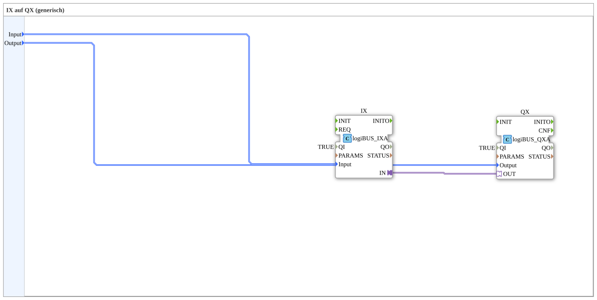

Here is the documentation for the exercise based on the provided XML data:
# Exercise_003a_AX_sub: IX to QX (generic)

* * * * * * * * * *
## Introduction
This exercise covers a sub-application (`SubAppType`) that establishes a generic connection between a logiBUS input and a logiBUS output. The function block is used to route a signal from a defined hardware input directly to a defined hardware output (mapping from IX to QX).

## Function Blocks (FBs) Used

In this exercise, a sub-application is defined that internally accesses specific hardware driver blocks of the logiBUS system.

### Sub-Blocks: Exercise_003a_AX_sub
- **Type**: SubAppType
- **Internal Function Blocks Used**:
- **QX**: `logiBUS::io::DQ::logiBUS_QXA`
- **Parameter**: `QI` = `TRUE` (Block is activated)
- **Data Input**: `Output` (Connected to the SubApp input `Output` to identify the hardware output)
- **Adapter Input**: `OUT` (Receives the signal from the input block)
- **IX**: `logiBUS::io::DI::logiBUS_IXA`
- **Parameter**: `QI` = `TRUE` (Block is activated)
- **Data Input**: `Input` (Connected to the SubApp input `Input` to identify the hardware input)
- **Adapter Output**: `IN` (Sends the signal to the output block)
- **Functionality**:

This sub-block encapsulates the logic to link a digital input to a digital output in a hardware-independent manner. Only the identifiers for the desired input (`Input`) and output (`Output`) are passed via the Sub-Application interface.

## Program Flow and Connections

The flow within the sub-application is as follows:

1. **Configuration**:

- The input `Input` (type: `logiBUS_DI_S`) determines which physical input (e.g., I1..I8) is to be read. This value is passed to the internal block `IX`.
- The input `Output` (type: `logiBUS_DO_S`) determines which physical output (e.g., Q1..Q8) is to be switched. This value is passed to the internal block `QX`.

2. **Signal Processing**:

- The actual signal transmission takes place via an adapter connection.
- The adapter output `IN` of the input block `IX` is directly connected to the adapter input `OUT` of the output block `QX`.
- This direct connection mirrors the logical state of the configured input directly to the configured output.

3. **Initialization**:

- Both internal blocks (`IX` and `QX`) are permanently enabled because their `QI` inputs are fixed to `TRUE`.

**Learning Objectives:**

- Understanding sub-applications for encapsulating logic.
- Use of generic logiBUS function blocks (`_IXA`, `_QXA`).
- Use of adapter connections for direct coupling of hardware abstraction layers.

## Summary
The `Uebung_003a_AX_sub` is a reusable function block that acts as a "pass-through connector." It reads a specified digital input and writes its state directly to a specified digital output without any intermediate logic processing. This is ideal for simple I/O tests or direct hardware connections.
